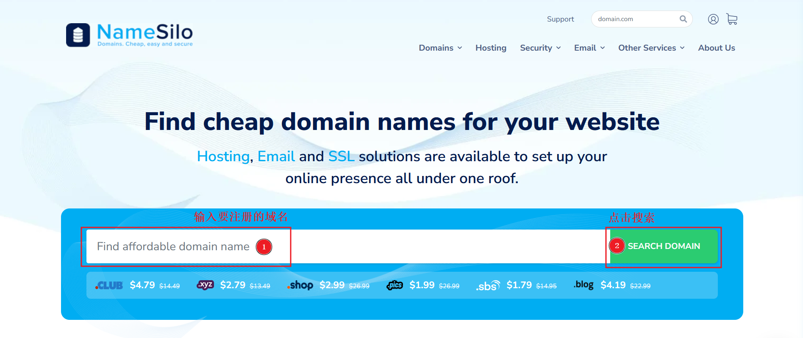
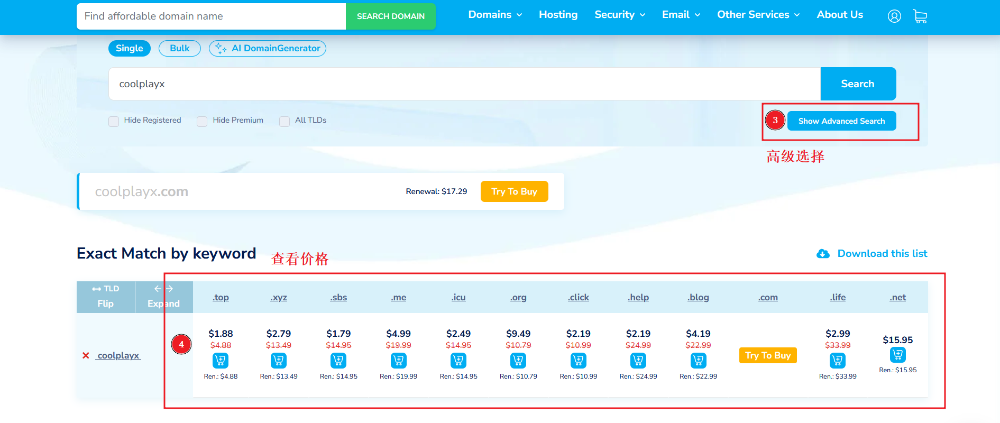
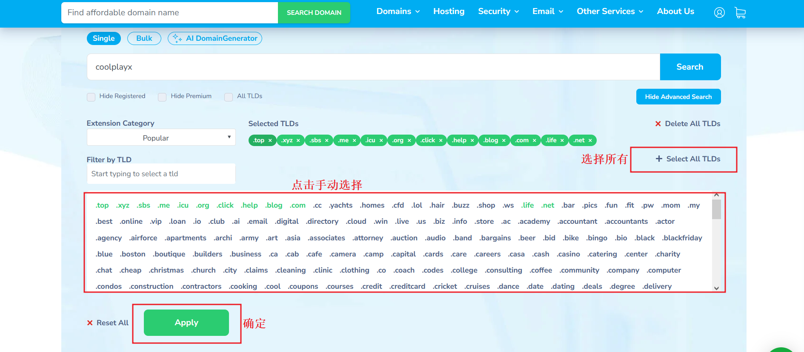
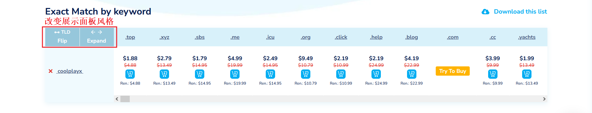
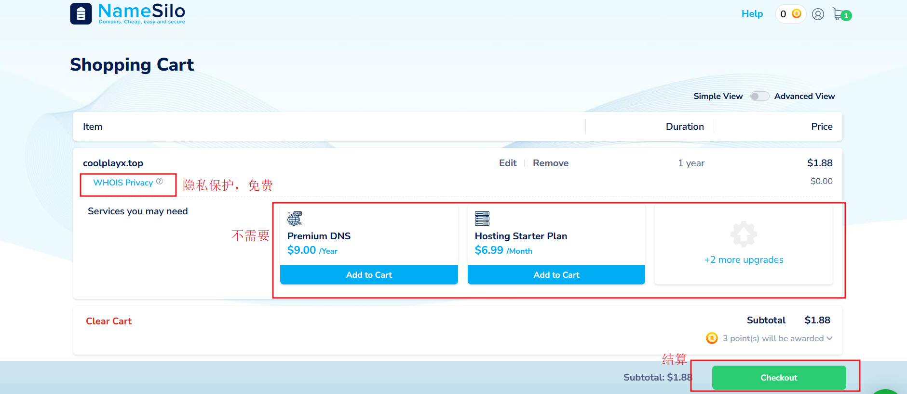
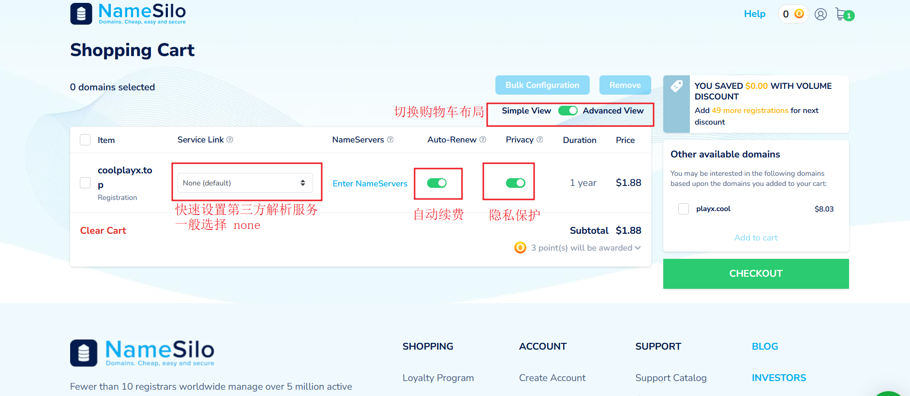
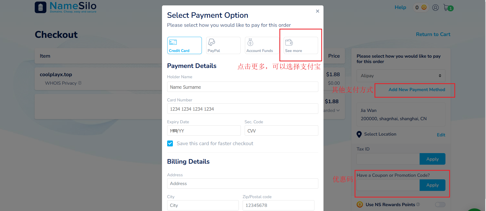
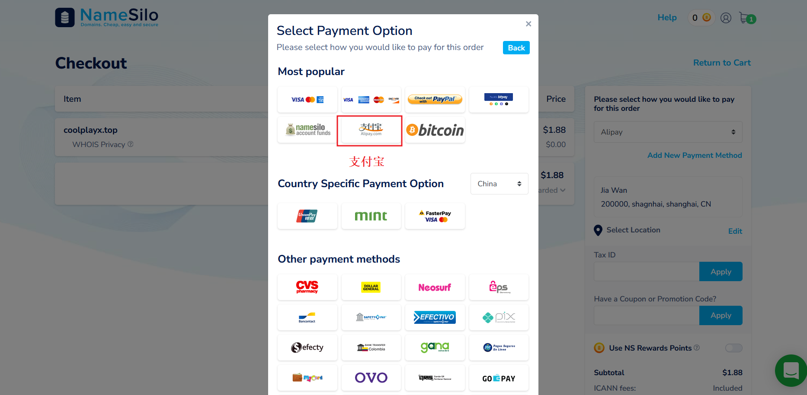

+++
title = "购买域名"
weight = 5
# bookFlatSection = false
# bookToc = true
# bookHidden = false
# bookCollapseSection = false
# bookComments = false
# bookSearchExclude = false
+++

## 搭建代理为什么需要域名

因为目前最有效的代理方式，就是将代理流量基于安全的 HTTPS 连接，而 HTTPS 依赖 SSL/TLS 证书，申请证书则需要域名。

>注：
>
> 没有域名，直接为 IP 地址申请 SSL/TLS 证书也是可行的，但极不推荐。
>
> 绝大多数 CA（证书颁发机构）不支持免费申请基于 IP 的证书。（ZeroSSL 可以免费申请基于 IP 的证书）
>
> 没有域名则只能使用 IP 访问服务器，安全性和灵活性大大降低。

## 购买域名

[NameSilo](https://www.namesilo.com/)

NameSilo 现在也是较为老牌的域名注册商之一了。
- ~~首年价和~~续费性价比较高
- 提供免费的 WHOIS 隐私保护
- 几乎没有优惠活动，价格透明，可以支付宝付款

于 2024 年 9 月份第二次调价后，第一年的购入价格不一定最便宜了，但续费价格依旧是最优惠的注册商之一。

在早年，大部分商家的域名隐私保护是收费的，而 Namesilo 一直都是免费。不过现在这点的优势没那么大了。

当然我最喜欢的还是不搞促销活动，常用的顶级域 `.com`，`.org`，`.net` 全年保持统一价格，而大多数冷门的顶级域则是常年挂着折扣价。

> 我唯一知道的活动，新用户订单超过 10 美元可以使用老用户提供的优惠码抵扣 1 美元，且每个账号仅能优惠一次。

[GoDaddy](https://www.godaddy.com/)

可以说是行业老大，虽然第一年相对便宜，但续费价格偏高。

## NameSilo 购买域名图文步骤

① 输入想要注册的域名，点击搜索

② 可以使用高级搜索功能，选择更多顶级域名查看

高级搜索页面

③ 查看域名列表，点击购物车图标添加到购物车，准备结算

④ 进入购物车页面

可以切换购物车布局

⑤ 支付页面，可以选择支付方式，如果是新用户第一次购买，可以添加优惠码

选择支付宝

⑥ 第一次购买后，如果出现域名快速设置页面可以先不用管（点击我的账号随时可以进入域名管理页面）；若需要验证邮箱或补全个人信息时，按照提示添加个人信息，如地址信息、联系方式等；

⑦ 点击我的账号，可以进入域名管理页面
