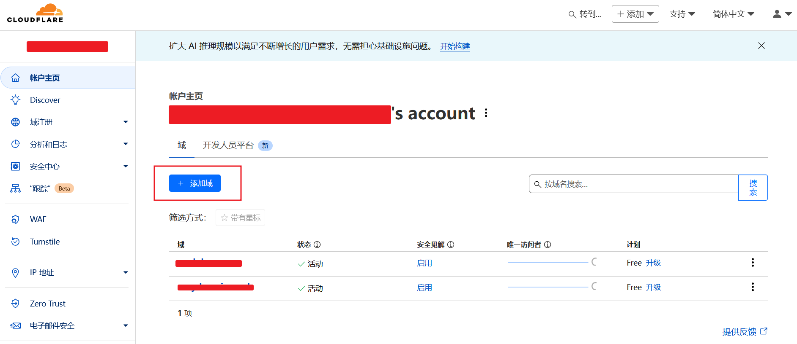
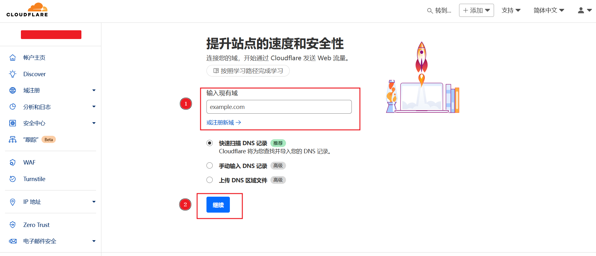
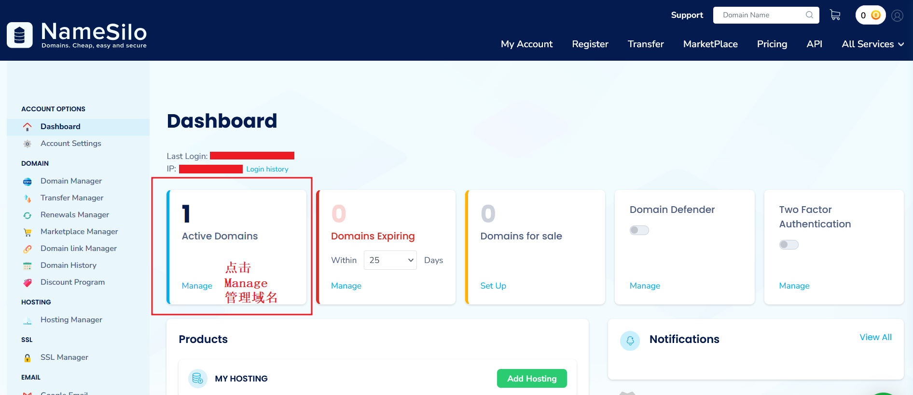
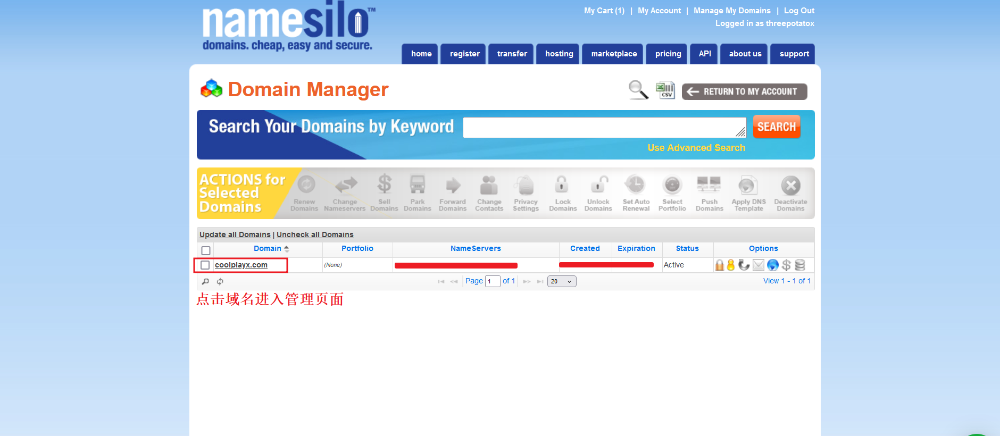
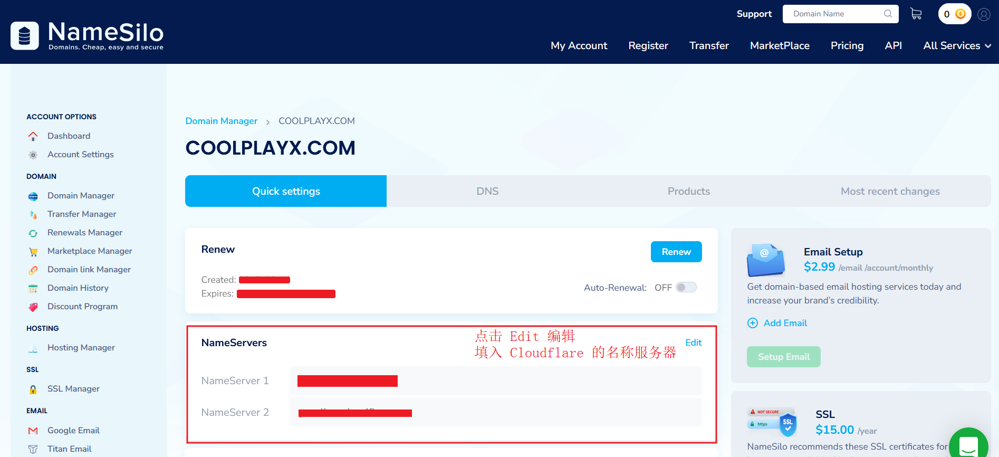
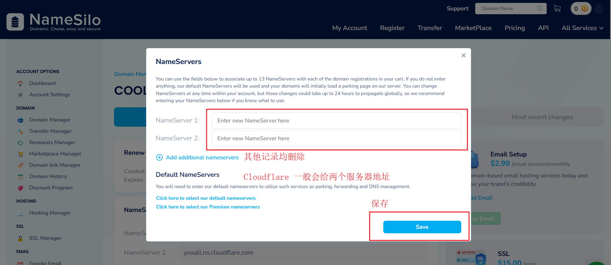

+++
title = "Cloudflare 托管域名"
weight = 6
# bookFlatSection = false
# bookToc = true
# bookHidden = false
# bookCollapseSection = false
# bookComments = false
# bookSearchExclude = false
+++

Cloudflare 有许多个人可以使用的免费服务，但前提是域名由 Cloudflare 管理。

## 将域名托管到 Cloudflare

打开 [Cloudflare 面板](https://dash.cloudflare.com/)，添加域名后，并根据提示，更新域名注册商的名称服务器，将其指向 Cloudflare。这样才能使用 Cloudflare 提供的各种服务。之后，域名的续费在注册商，域名的管理在 Cloudflare。

如果是在 Cloudflare 注册购买的域名，应该不需要这个步骤。

## 将 NameSilo 域名托管到 Cloudflare 图文步骤

① 进入 Cloudflare 面板页面，添加域

添加注册的域名

点击继续后，按照提示选择免费套餐，然后会分配一组 Cloudflare 的名称服务器（NameServers）

② NameSilo 更新名称服务器

进入域名注册商的管理页面，更新名称服务器。这里用 NameSilo 示例

管理页面

域名列表，展示所有注册的域名

点击需要管理的域名，进入相应域名的设置页面

更新名称服务器

填入上面 ① 步骤中 Cloudflare 给的名称服务器，点击 Save 保存

③ 等待名称服务器更新

返回 Cloudflare 面板页，点击完成。等待 10 分钟左右，Cloudflare 的名称服务器会生效，此时域名完全由 Cloudflare 管理，NameSilo 仅负责续费。
