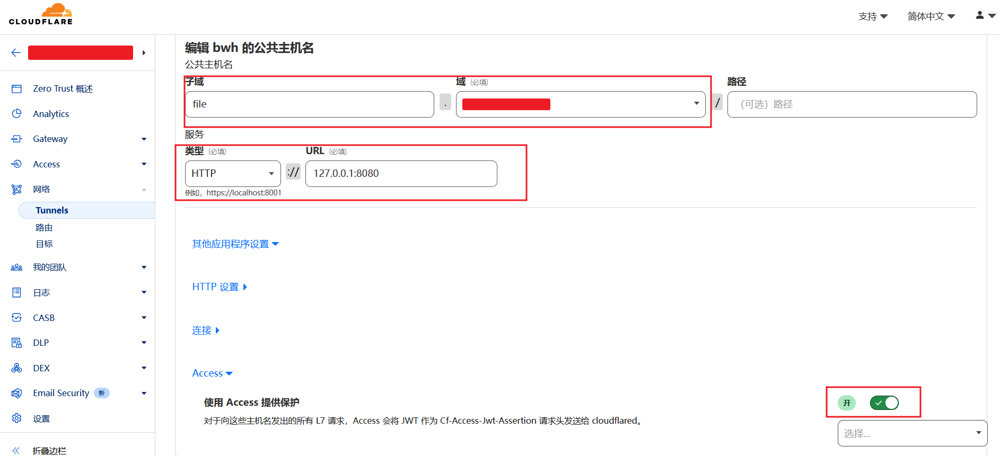
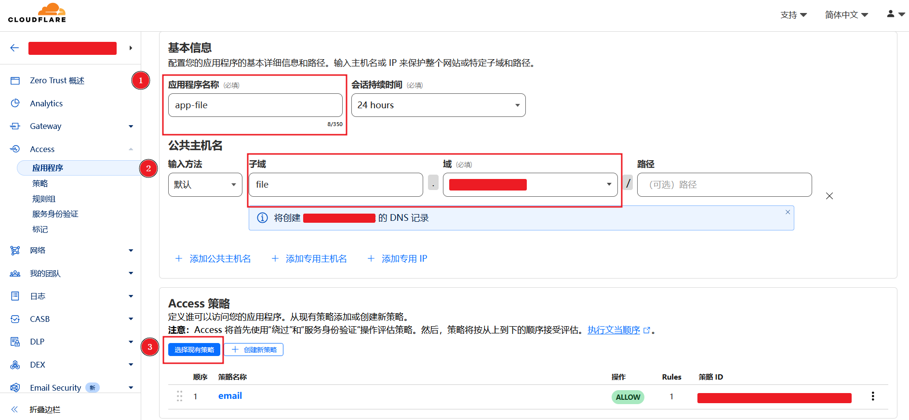
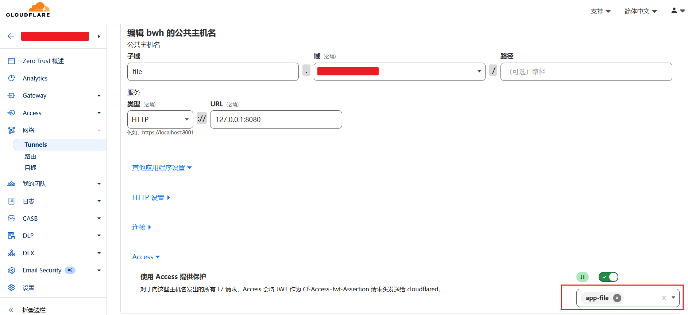
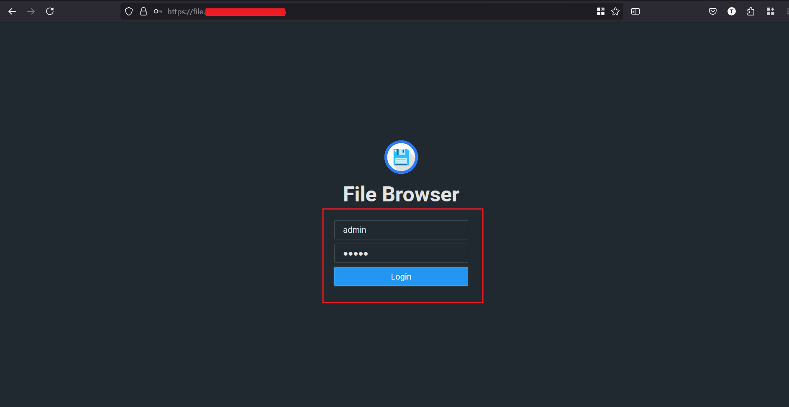
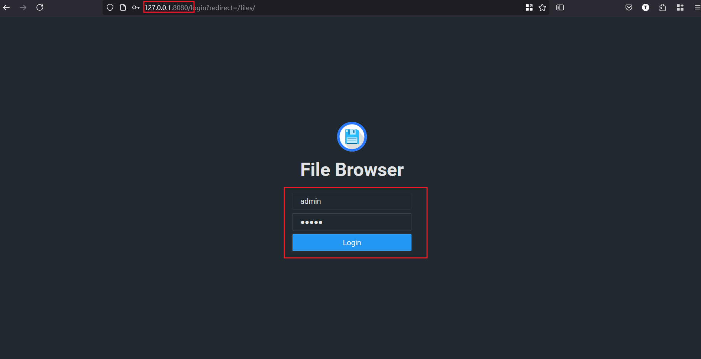

+++
title = "Cloudflare Tunnel 搭建 File Browser"
weight = 16
# bookFlatSection = false
# bookToc = true
# bookHidden = false
# bookCollapseSection = false
# bookComments = false
# bookSearchExclude = false
+++

## 注意

> 可参考本站另一篇 [Cloudflare Tunnel 搭建 Web SSH - 注意](/docs/cloudflare-tunnel-web-ssh/#%e6%b3%a8%e6%84%8f)

## 使用 Docker 安装 File Browser

因为 Cloudflare Tunnel 和 Access 搭建的 Web SSH，在网页界面没办法上传下载文件。

所以这里选择搭建一个轻量文件服务，类似小型“网盘”，提供网页端文件管理、预览和文本编辑等功能。

### 示例目录结构

```shell
# 示例目录结构
# /root
# ├── filebrowser-start-docker.sh
# └── filebrowser
#        ├── .filebrowser.json
#        └── filebrowser.db
```

### File Browser 配置示例

示例配置文件路径：`/root/filebrowser/.filebrowser.json`

```json
// 默认 /srv 为网站根路径
{
  "port": 80,
  "baseURL": "",
  "address": "",
  "log": "stdout",
  "database": "/database/filebrowser.db",
  "root": "/srv"
}
```

### Docker/Podman 安装 File Browser 示例

下面是 Shell 脚本示例，可以保存成 `filebrowser-start-docker.sh` 文件后运行。

{}

{}

```bash
#!/bin/bash

docker container stop filebrowser
docker container rm filebrowser

# File Browser 配置默认 /srv 为网站根路径
# /root 目录挂载到 /srv
# 所以 File Browser 可以访问 /root 目录下的所有文件

docker container run \
    --name filebrowser \
    -d \
    -v /root:/srv \
    -v /root/filebrowser/.filebrowser.json:/.filebrowser.json \
    -v /root/filebrowser/filebrowser.db:/database.db \
    -u $(id -u):$(id -g) \
    -p 127.0.0.1:8080:80 \
    docker.io/filebrowser/filebrowser
```

{}

{}

```bash
#!/bin/bash

podman container stop filebrowser
podman container rm filebrowser

# File Browser 配置默认 /srv 为网站根路径
# /root 目录挂载到 /srv
# 所以 File Browser 可以访问 /root 目录下的所有文件

podman container run \
    --name filebrowser \
    -d \
    -v /root:/srv \
    -v /root/filebrowser/.filebrowser.json:/.filebrowser.json \
    -v /root/filebrowser/filebrowser.db:/database.db \
    -u $(id -u):$(id -g) \
    -p 127.0.0.1:8080:80 \
    docker.io/filebrowser/filebrowser
```

{}

{}

运行脚本命令：

```bash
bash /root/filebrowser-start-docker.sh
```

## 搭建 Cloudflared Tunnel 和 Access

可参考本站另一篇 [Cloudflare Tunnel 搭建 Web SSH - 图文步骤](/docs/cloudflare-tunnel-web-ssh/#cloudflare-tunnel-%e6%90%ad%e5%bb%ba-web-ssh-%e5%9b%be%e6%96%87%e6%ad%a5%e9%aa%a4)

因为 VPS 已经安装了 cloudflared，File Browser 容器启动时仅监听本地 127.0.0.1，所以只需以下步骤：

### 4. 添加 Tunnel 公共主机名

File Browser 是 Web 服务，选择 HTTP 协议：



### 5. 添加 Cloudflare Access

File Browser 是 Web 服务，不需要设置浏览器渲染：



### 6. Tunnel 公共主机选择 Access

非浏览器渲染的 Access，选择框可见，直接选择保存后，不需要“第 7 步：多走一步”


### 9. 浏览器访问 File Browser 服务

此时浏览器访问公共主机名（示例为 `file.你的域名`），就会出现 Access 验证页面，验证成功即可登录 File Browser：

默认登录：
- 用户名：admin
- 密码：admin
- 登录后建议设置页面改密



## 使用代理连接 File Browser

因为容器启动设置了仅监听本机，所以使用代理连接时，只能自定义代理工具配置文件，添加提供 **本地转发** 功能的协议。

本站示例 [客户端 - Windows v2rayN 添加自定义服务节点](/docs/proxy-client/#windows-v2rayn-%e6%b7%bb%e5%8a%a0%e8%87%aa%e5%ae%9a%e4%b9%89%e6%9c%8d%e5%8a%a1%e8%8a%82%e7%82%b9)，自定义的 Hysteria2 配置中，已经添加了 **本地转发** 配置，并开启了 v2rayN 前置代理。

所以用户设备使用代理连接 VPS 的 File Browser 服务时，只需浏览器访问 127.0.0.1:8080：


