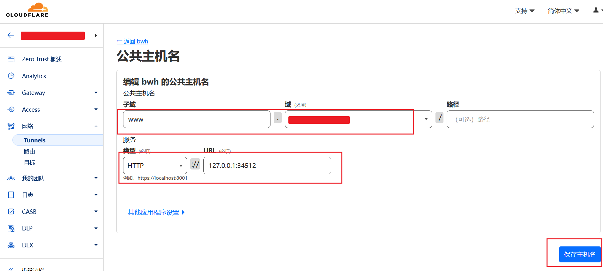

+++
title = "Cloudflare Tunnel 搭建代理"
weight = 17
# bookFlatSection = false
# bookToc = true
# bookHidden = false
# bookCollapseSection = false
# bookComments = false
# bookSearchExclude = false
+++

## 注意

> 可参考本站另一篇 [Cloudflare Tunnel 搭建 Web SSH - 注意](/docs/cloudflare-tunnel-web-ssh/#%e6%b3%a8%e6%84%8f)

## 为什么使用 Cloudflare Tunnel 搭建代理

作为 VPS 的 IP 被封的解决方案。

使用 Tunnel 搭建的代理服务，可以是完全的内网服务（仅监听本机），所以也不用手动管理 SSL/TLS 证书。

> 注：
>
> 和使用 Cloudflare CDN 作为跳板来实现翻墙，解决 IP 被封的区别：
>
> - CDN + SSL/TLS + WebSocket + 代理协议
>
> CDN 代理的方式，需要代理服务监听公网端口，且代理服务要安装 SSL/TLS 证书
> - 因为 CDN 代理，是**由 CDN** 发起连接请求**到代理服务**
> - 所以代理服务要监听公网端口可以让 CDN 连接
>
>  CDN 代理的方式，可归为正向代理，Tunnel 代理的方式，可归为反向代理。
>
> 两者最终都是走的 Cloudflare 网络（免费套餐），速度上应该没差别。
>
> 但从我自己的使用经验来说，CDN 代理的方式被封过，Tunnel 代理的方式暂时没被封过（也可能因为使用的时间较短）。

## 使用 Docker 安装 sing-box 搭建代理

因为要和 Tunnel 搭配使用，所以代理协议必须是 Tunnel 支持的协议，所以通常选择兼容 HTTP 系列的代理协议来搭建代理。

这里选择 VMess + HTTPUpgrade 代理协议作为示例。

常见的 V2Fly（原 V2Ray）/Xray/sing-box 等 core 均可搭建上述代理协议。
- VMess + HTTPUpgrade 是由 Project V 社区维护的，所以之前一直用 V2Ray 系列的核心
- 但 sing-box 原生支持 TUN，所以最近转到了 sing-box 

### 示例目录结构

```shell
# 示例目录结构
# /root
# ├── sing-box-start-docker.sh
# └── sing-box
#        └── config.json
```

### sing-box 配置示例

UUID 可以通过 v2rayN 客户端添加 VMess 服务节点页面生成，或者找个在线 UUID 生成网站


示例配置文件路径：`/root/sing-box/config.json`

```json
// your_uuid：替换为自己的 uuid
// your_path：替换成自己的自定义路径
{
  "log": {
    "disabled": false,
    "level": "info",
    "output": "",
    "timestamp": true
  },
  "inbounds": [
    {
      "type": "vmess",
      "listen": "127.0.0.1",
      "listen_port": 34512,
      "users": [
        {
          "uuid": "your_uuid",
          "alterId": 0
        }
      ],
      "transport": {
        "type": "httpupgrade",
        "path": "/your_path"
      }
    }
  ],
  "outbounds": [
    {
      "tag": "warp-out",
      "type": "socks",
      "server": "127.0.0.1",
      "server_port": 1080,
      "version": "5",
      "network": [
        "tcp",
        "udp"
      ],
      "udp_over_tcp": false
    },
    {
      "tag": "direct",
      "type": "direct"
    }
  ],
  "route": {
    "rules": [
      {
        "ip_cidr": [
          "127.0.0.1/32"
        ],
        "action": "route",
        "outbound": "direct"
      }
    ]
  }
}
```

### Docker/Podman 安装 sing-box 示例

下面是 Shell 脚本示例，可以保存成 `sing-box-start-docker.sh` 文件后运行。

{}

{}

```bash
#!/bin/bash

docker container stop sing-box
docker container rm sing-box

docker container run \
 --name sing-box \
 --mount type=bind,source=/root/sing-box/config.json,target=/etc/sing-box/config.json,readonly \
 -d \
 --network=host \
 ghcr.io/sagernet/sing-box \
 -D /var/lib/sing-box \
--config /etc/sing-box/config.json  run
```

{}

{}

```bash
#!/bin/bash

podman container stop sing-box
podman container rm sing-box

podman container run \
 --name sing-box \
 --mount type=bind,source=/root/sing-box/config.json,target=/etc/sing-box/config.json,readonly \
 -d \
 --network=host \
 ghcr.io/sagernet/sing-box \
 -D /var/lib/sing-box \
--config /etc/sing-box/config.json  run
```

{}

{}

运行脚本命令：

```bash
bash /root/sing-box-start-docker.sh
```

## 搭建 Cloudflared Tunnel 和 Access

可参考本站另一篇 [Cloudflare Tunnel 搭建 Web SSH - 图文步骤](/docs/cloudflare-tunnel-web-ssh/#cloudflare-tunnel-%e6%90%ad%e5%bb%ba-web-ssh-%e5%9b%be%e6%96%87%e6%ad%a5%e9%aa%a4)

因为 VPS 已经安装了 cloudflared，sing-box 容器启动时仅监听本地 127.0.0.1，所以只需以下步骤：

### 4. 添加 Tunnel 公共主机名

sing-box 服务端入口协议是 HTTPUpgrade，Tunnel 公共主机名服务类型选择 **HTTP** 协议。

因为代理客户端无法通过 Access 邮箱验证策略，所以 **不开启 Access 保护**。



## 代理客户端添加服务节点示例

### 1. v2rayN 添加 VMess 服务节点


### 2. v2rayN 添加自定义 sing-box 服务节点

本站示例 [客户端 - Windows v2rayN 添加自定义服务节点](/docs/proxy-client/#windows-v2rayn-%e6%b7%bb%e5%8a%a0%e8%87%aa%e5%ae%9a%e4%b9%89%e6%9c%8d%e5%8a%a1%e8%8a%82%e7%82%b9) 添加的是 Hysteria2 核心

这里注意自定义节点页面选择 sing-box 核心类型。


sing-box 客户端自定义配置文件示例：

{}

{}

```json
// your_uuid：替换为自己的 uuid
// your_path：替换成自己的自定义路径
{
  "log": {
    "disabled": false,
    "level": "info",
    "output": "",
    "timestamp": true
  },
  "inbounds": [
    {
      "tag": "mixed-in",
      "type": "mixed",
      "listen": "127.0.0.1",
      "listen_port": 1080,
      "set_system_proxy": false
    },
    {
      "tag": "ssh-direct-in",
      "type": "direct",
      "listen": "127.0.0.1",
      "listen_port": 29503,
      "network": [
        "udp",
        "tcp"
      ],
      "override_address": "127.0.0.1",
      "override_port": 29503
    },
    {
      "tag": "file-direct-in",
      "type": "direct",
      "listen": "127.0.0.1",
      "listen_port": 8080,
      "network": [
        "udp",
        "tcp"
      ],
      "override_address": "127.0.0.1",
      "override_port": 8080
    }
  ],
  "outbounds": [
    {
      "type": "vmess",
      "server": "www.你的域名",
      "server_port": 443,
      "uuid": "your_uuid",
      "security": "aes-128-gcm",
      "alter_id": 0,
      "tls": {
        "enabled": true,
        "server_name": "www.你的域名",
        "utls": {
          "enabled": true,
          "fingerprint": "chrome"
        }
      },
      "packet_encoding": "packetaddr",
      "transport": {
        "type": "httpupgrade",
        "path": "/your_path"
      }
    }
  ]
}
```

{}

{}