+++
title = "Cloudflare Tunnel 搭建 Web SSH"
weight = 15
# bookFlatSection = false
# bookToc = true
# bookHidden = false
# bookCollapseSection = false
# bookComments = false
# bookSearchExclude = false
+++

## 注意

> 注意：
>
> 国内正常情况下，使用 Cloudflare Tunnel 搭建的服务是可以直连的。但因为是免费套餐，不同地区、不同时间段的网络直连质量可能会有差异。
>
> 1. 使用 Cloudflare Tunnel 搭建相关服务，用户端连接时，会走 Cloudflare 的网络，所以需要用户端网络可以正常连接到 Cloudflare
>     - 网络可连，只需要 HTTP/S 协议的流量可以正常连接
>     - 一般情况下，Cloudflare 在国内的 HTTP/S 访问是正常的
>     - 能直连登录 Cloudflare 官网就没问题
>     - 但有时侯搭建的服务会很卡（因为是免费套餐），特别是傍晚八九点的时候，搭建测试的时候建议白天上午或凌晨后半夜进行
> 2. 新添加的服务，可以等待三五分钟后再访问
>     - 因为新添加服务会自动添加子域名解析，需要 DNS 服务扩散
> 3. 如果按照下面流程走，但最后无法连接，很可能是用户端和 Cloudflare 之间网络连接问题
>     - 或者，搭建测试时，使用代理访问搭建的服务，以排除国内网络的连接问题
>     - 如果用户设备使用物联网卡流量，搭建测试时建议开手机热点用正常手机卡流量

## 为什么搭建 Web SSH

因为 SSH 协议特征明显，VPS 的 sshd 端口很容易被封（也有可能直接被封 IP）。

所以如何安全登录管理 VPS，是一个问题。

- 方式一（保底方式）：可以通过 VPS 服务商的管理页面登录管理 VPS
    - 除非 VPS 服务商被封，这种方式一定有效
    - 但有些服务商的管理页面简陋不好用

- 方式二：SSH 使用代理连接 VPS
    - 在没有代理前，或者代理被封，这种方式就失效了

- 方式三：搭建使用 HTTP/S 系列协议的 Web Terminal/SSH 网页终端或 SSH 工具
    - 需在 VPS 搭建相关服务，通常较轻量级
    - 网页远程终端，如 [ttyd](https://github.com/tsl0922/ttyd)
    - 网页 SSH 工具，如 [Sshwifty](https://github.com/nirui/sshwifty)

下面是 `远程终端` 和 `Web SSH 工具` 的数据通信差别（只作为一般情况下的示意）：

远程终端：
- SSH 本质上也是远程终端，只不过通信协议为 SSH 协议

```bash
+---------+     http     +------+    stdin    +----------------+
| browser | <==========> | ttyd | <=========> | PTY / TTY 驱动 |
+---------+   websocket  +------+    stdout   +----------------+
```

Web SSH 工具：
- 前端页面通常提供管理多个 SSH 连接的功能

```bash
+---------+     http     +----------+    ssh    +------------+    stdin    +----------------+
| browser | <==========> | Sshwifty | <=======> | ssh server | <=========> | PTY / TTY 驱动 |
+---------+   websocket  +----------+    ssh    +------------+    stdout   +----------------+
```

- 方式四：搭建跳板机/堡垒机服务
    - 此类服务更倾向于安全审计和资源管理，通常前端使用 HTTP/S 通信，后端支持多种协议，如 [JumpServer](https://github.com/jumpserver/jumpserver)
    - 算是方式三的升级版，有多台 VPS 时可以考虑这种方式

- Cloudflare Tunnel 方案：

> 可参考本站 [Cloudflare Zero Trust 简介](/docs/cloudflare-zero-trust/)

因为 Cloudflare Tunnel 支持 SSH 协议，并且可以部署成 `浏览器 SSH` 应用。

不仅把 SSH 转成了 Web，还能无缝使用 Cloudflare Access 自定义访问策略。

本质上，这种方式可以归为 `内网穿透`。

那为什么不直接在 VPS 上搭建内网穿透相关的服务，以实现直连 VPS 呢？

因为如果 VPS 的 IP 被封，直连 VPS 的所有服务都会失效，而通过 Tunnel 搭建的服务依然能用。

所以此方案能满足基本要求外：
- SSH 可以通过 HTTP/S 方式连接

还有两个额外原因：
- 无缝使用 Access，限制其他人访问
- 作为 IP 被封的解决方案
    - 后续还会使用 Tunnel 再搭建一个代理通道

所以本篇会以 Cloudflare Tunnel 作为示例。

此方案连接路径示意：

```bash
+----------------------------------------+    http/s    +------------+    quic/http2    +------------------------+        +----------------+
| browser/cloudflared/warp（国内不能用） | <==========> | Cloudflare | <==============> | cloudflared tunnel run | <====> | other server   |
+----------------------------------------+              +------------+                  +------------------------+        +----------------+
```

## Cloudflare Tunnel 搭建 Web SSH 图文步骤

### 1. 创建 Cloudflare Tunnel

Zero Trust 面板 -> 网络 -> Tunnels -> 创建隧道 -> 选择 Cloudflared

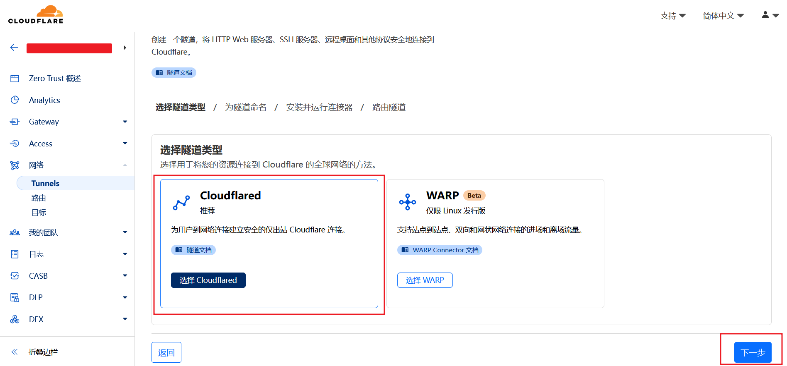

填写自定义隧道名称，保存隧道，示例为 `myvps`

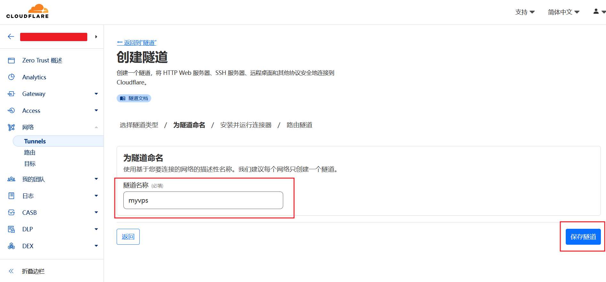

### 2. 复制 cloudflared 安装命令

选择 Docker 安装方式，复制页面中给的安装命令，主要是安装命令中的 **token**

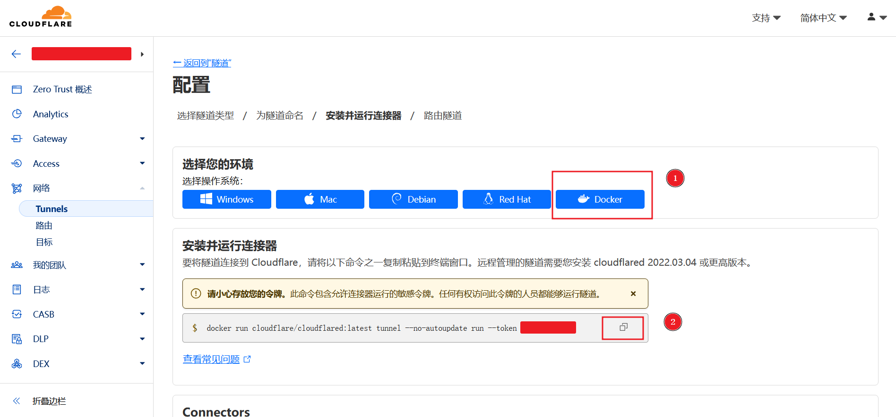

### 3. VPS 安装 cloudflared

登录到 VPS 服务器，用 docker 安装 cloudflared。

- 可用下面示例安装脚本，添加了容器启动参数
- 要把示例脚本中 **your_token_string** 换成自己上一步中复制的 **token**

{}

{}

```bash
#!/bin/bash

docker stop cloudflared
docker rm cloudflared

# --network=host：容器网络使用宿主机命名空间，方便使用 127.0.0.1 访问宿主机服务资源
# --protocol http2：cloudflared 默认只用 QUIC 协议，加上 http2 后，若 QUIC 不可用会自动回退 HTTP/2 协议
# --token：后面替换成自己复制的 token
docker container run \
--name cloudflared \
--network=host \
-d \
docker.io/cloudflare/cloudflared:latest tunnel --no-autoupdate --protocol http2 run --token your_token_string
```

{}

{}

```bash
#!/bin/bash

podman stop cloudflared
podman rm cloudflared

# --network=host：容器网络使用宿主机命名空间，方便使用 127.0.0.1 访问宿主机服务资源
# --protocol http2：cloudflared 默认只用 QUIC 协议，加上 http2 后，若 QUIC 不可用会自动回退 HTTP/2 协议
# --token：后面替换成复制的 token
podman container run \
--name cloudflared \
--network=host \
-d \
docker.io/cloudflare/cloudflared:latest tunnel --no-autoupdate --protocol http2 run --token your_token_string
```

{}

{}

可将示例命令保存成脚本文件 `cloudflared-start-docker.sh`

运行脚本命令：

```bash
bash cloudflared-start-docker.sh
```

容器启动成功即安装成功。

### 4. 添加 Tunnel 公共主机名

返回 Cloudflare 管理页面。

若没有退出创建隧道页面，点击下一步，添加公共主机名

或者

Tunnels 主界面 -> 隧道名称（示例为 `myvps`） -> 编辑 -> 添加公共主机名

此界面就是用来添加 cloudflared 代理的服务的。

本次添加 SSH 服务：

- 添加公共主机名
    - 自定义一个子域名的名称
    - 选择主域名
- 添加 SSH 服务，即 cloudflared 代理的服务地址
    - 因为 cloudflared 使用 --network=host 容器参数安装在 VPS 本机上
    - 所以可用 127.0.0.1 访问 VPS 本机的 SSH 服务
    - VPS 本机的 sshd 监听端口号为 27003
- 打开 **使用 Access 提供保护**
    - 选择框为空，操作完下几步会再回来选择（见第 6 步）
    - 若此服务不限制访问，不需要开启此功能或后续 Access 策略配置为所有人

Cloudflare 设计在这里的 **使用 Access 提供保护** 开关，有两个主要作用：
1. Tunnel 新添加的服务需要 Access 的保护，但因为是新服务，搭建好 Access 需要先添加 Tunnel
    - 开启此开关后，可以保护真正搭建好 Access 之前的这段空白期，此时外界访问权为零
2. 搭建好 Access 的服务（见下几步），若失误删除了 Access
    - 此时服务的 Access 实际为空，此时外界访问权为零

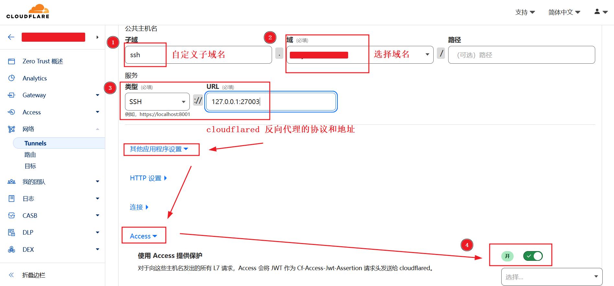

### 5. 添加 Cloudflare Access

Zero Turst 主界面 -> Access -> 应用程序 -> 添加应用程序

选择 **自托管**

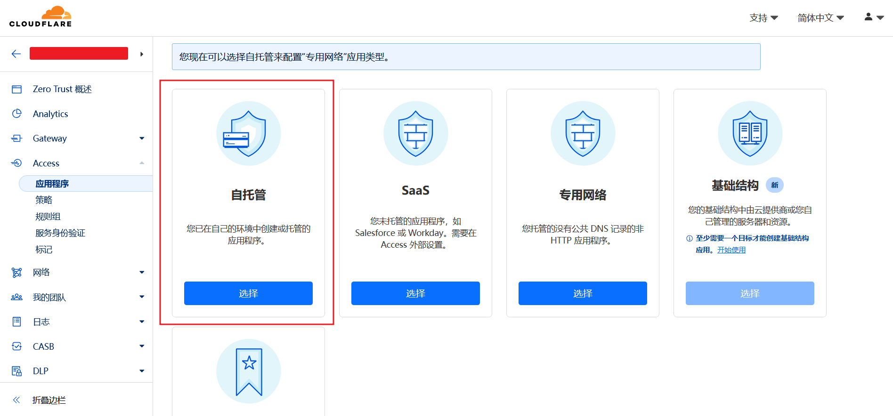

填写信息
- 自定义应用程序名称
- **添加公共主机名**
    - 在上一步 Tunnel 中添加的公共主机名
- 添加策略
    - 这里选择了之前创建好的 email 策略
- 其他保持默认，一直点击下一步，保存
    - 完成下一步后会再回来设置（见第 7 步）

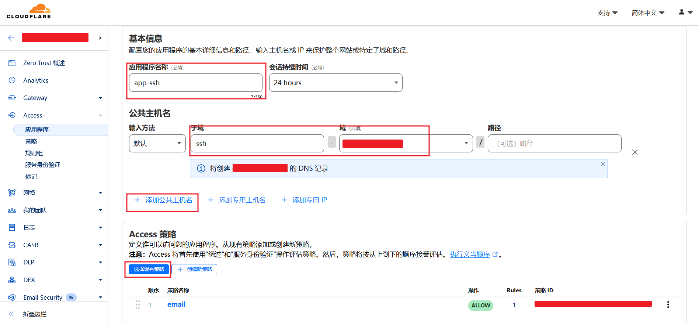

### 6. Tunnel 公共主机选择 Access

Tunnels 主页面 -> 隧道名称 -> 编辑 -> 公共主机名 -> 公共主机名（示例为 `ssh.你的域名`） -> 编辑

在 **使用 Access 提供保护** 开关下面，选择上一步搭建好的 Access 应用程序，示例为 `app-ssh`，保存

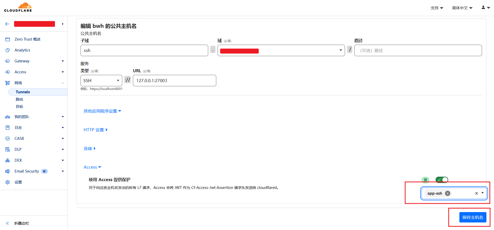

### 7. 多走一步：返回 Access 选择浏览器渲染为 SSH

Access 主界面 -> 应用程序 -> 应用程序名称（示例为 `app-ssh`） -> 配置 -> 高级设置

浏览器呈现设置，选择为 SSH，保存

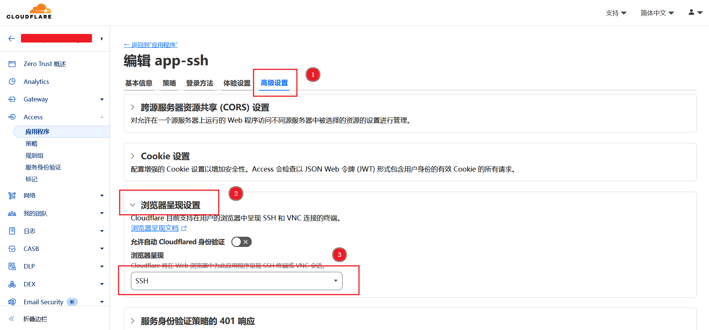

### 8. 为什么多走 **第 7 步** 再设置浏览器 SSH

> 此 bug 反馈：https://github.com/cloudflare/cloudflared/issues/938

如果把 Access 应用程序设置为浏览器渲染，在 **使用 Access 提供保护** 开关下面，选择框不会出现对应的应用程序，无法设置所以外界访问权为零。

解决思路：
- 方案一：已经搭建好 Access 了，只要 Access 实际存在并设置正确，就会验证用户访问第 5 步中设置的公共主机名，所以此开关可关闭
    - 但此开关的第二个作用就没法使用了，如果误删了 Access，这里为关闭状态，则访问权为任何人
- 方案二：通过“多走一步”
    - 完成 **第 7 步** 后，再进来查看选择框，虽然选择框不显示 **第 6 步** 选择的 `app-ssh`，但实际有作用
    - 进来查看选择框时，千万别保存，一保存就成真的空值了
        - 若误操作，可以先关闭 Access 浏览器渲染，“多走一步”再次添加

**特别注意**：
- 若误删 Access 后又直接创建了同名的 Access，要对使用此 Access 的公共主机名重新选择新建同名 Access：
    - 其 **使用 Access 提供保护** 开关下面的 **选择框**，建议 **删除同名 Access 后保存一次**，再选择**新建的同名 Access 保存一次**
    - 特别是浏览器渲染的 Access，一定要按照“多走一步”重新添加保存新建的同名 Access，否则会无法访问

### 9. 浏览器访问 SSH 服务

此时浏览器访问公共主机名（示例为 `ssh.你的域名`），就会出现 Access 验证页面，验证成功即可登录 SSH

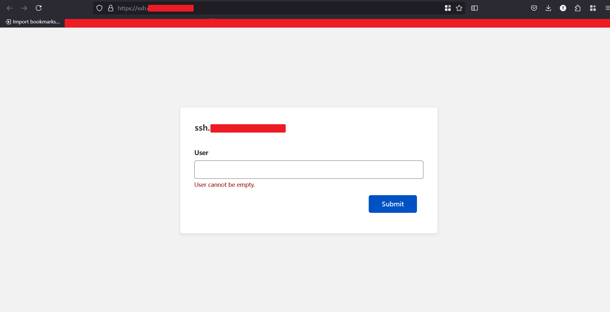


### 10. 设置 sshd 服务仅监听本机

虽然现在用公共主机名访问，Cloudflare Access 会验证访问权限，但此时依旧可以使用 VPS 的真实公网 IP 直连 SSH 服务。

所以登录 VPS 将 sshd 服务设置并重启为仅监听本机，将 sshd 变成完全的内网服务，进一步减小 VPS 被攻击的可能性：

{}

{}

```bash
# sshd 配置文件路径：
# /etc/ssh/sshd_config.d

# 将下面添加到 sshd 配置文件
ListenAddress 127.0.0.1
ListenAddress ::1
```

{}

{}

```bash
# sshd 配置文件路径：
# /etc/ssh/sshd_config.d

# 执行命令将下面参数追加到 sshd 配置文件
echo "ListenAddress 127.0.0.1" >> /etc/ssh/sshd_config
echo "ListenAddress ::1" >> /etc/ssh/sshd_config
```

{}

{}

```bash
# 重启 sshd 服务
systemctl restart sshd
```

### 11. 手动管理添加的自定义子域名

**第 4 步** 添加公共主机名时，会自动为自定义子域名添加 DNS 记录。

若删除相关 Tunnel 公共主机名和 Access 应用程序后，没有自动删除对应的子域名 DNS 记录，可在 Cloudflare 主面板，进入域名主页，查看 DNS 记录，然后手动管理删除。
- 若子域名还在用，删除后，因为没有 DNS 解析了也就没法访问了
- 若误删，可以通过第 4 步，重新添加公共主机名，会自动添加子域名 DNS 记录

如图，自动添加的 `ssh` 子域名
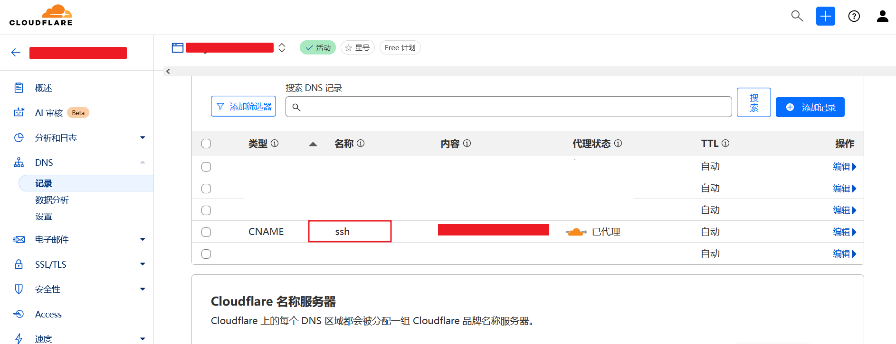

### 12. 命令行连接 sshd 服务

[Cloudflare Docs - Connect to SSH with client-side cloudflared (legacy)](https://developers.cloudflare.com/cloudflare-one/connections/connect-networks/use-cases/ssh/ssh-cloudflared-authentication/)

通过 Cloudflare Tunnel 和 Access 搭建的 Web SSH，无法上传本地文件和下载远程文件。
- 本篇开头提到的 ttyd 和 Sshwifyd，其前后端集成了文件上传下载工具，可以在 Web 页面上传下载文件。

所以需要命令行也能连接到 Tunnel 搭建的 sshd 服务，方便和用户本地其他命令行工具交互。

命令行连接 sshd，用户侧同样要安装 cloudflared，但不需要运行 tunnel run 模式。

#### 12.1 下载 cloudflared

进入 Cloudflare Zero Trust 主界面 -> 菜单栏最下面 设置 -> 资源 -> 选择下载 Windows cloudflared

安装 cloudflared

#### 12.2 生成 SSH ProxyCommand 配置参数

> 若不熟悉 ProxyCommand 的作用，可参考本站 [SSH ProxyCommand 简单介绍](/docs/ssh-configure-netcat_nc_nmap_ncat-to-use-proxy/#ssh-proxycommand-%e7%ae%80%e5%8d%95%e4%bb%8b%e7%bb%8d)

运行 cloudflared 命令生成 SSH ProxyCommand 参数
- 用户端示例执行代码使用的终端是 Git Bash，下同

替换为自己的公共主机名：

```bash
cloudflared-windows-amd64.exe access ssh-config --hostname ssh.你的域名
```

根据打印提示的路径，将配置添加到 SSH 配置文件中
- **注意：添加到配置文件开头**，SSH 读取配置文件会从前到后依次匹配 Host

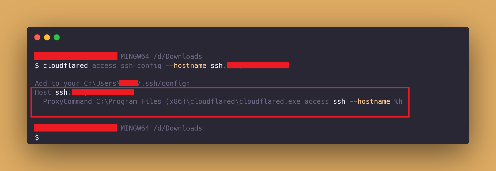

#### 12.3 手动 cloudflared 登录注册 Access 访问权限

```bash
cloudflared access login ssh.你的域名
```

会自动跳转浏览器，验证 Access
- 若没有自动跳转，可按照打印提示操作

#### 12.4 通过 cloudflared 连接 sshd

如果不执行上一步 **第 12.3 步**，第一次连接时也会自动跳转 Access 验证
- 但有时没反应，可通过上一步手动验证

```bash
ssh root@ssh.你的域名
```

若验证 Access 成功，此时命令行进入正常 SSH 认证流程，登录连接即可。

## 使用代理连接 sshd

Cloudflare Tunnel 搭建的相关服务虽然可以直连，但因为走的是 Cloudflare 的网络，有时候延迟会比搭建的代理要高。

所以代理正常的时候，可以通过代理连接 VPS，当代理被封或者调试代理或者出门在外其他设备上没有代理时，再直连 Cloudflare Tunnel 搭建的服务登录管理 VPS。

因为 **第 10 步** 设置了 sshd 服务仅监听本机，所以使用代理连接 sshd 时，只能自定义代理工具配置文件，添加提供 **本地转发** 功能的协议。

本站示例 [客户端 - Windows v2rayN 添加自定义服务节点](/docs/proxy-client/#windows-v2rayn-%e6%b7%bb%e5%8a%a0%e8%87%aa%e5%ae%9a%e4%b9%89%e6%9c%8d%e5%8a%a1%e8%8a%82%e7%82%b9)，自定义的 Hysteria2 配置中，已经添加了 **本地转发** 配置，并开启了 v2rayN 前置代理。

所以用户设备使用代理连接 VPS 的 sshd 服务时，只需运行：

```bash
ssh root@127.0.0.1 -p 27003
```

又因为本站 [SSH 配置 Natcat(nc)/Nmap(ncat) 使用代理](/docs/ssh-configure-netcat_nc_nmap_ncat-to-use-proxy/#ssh-%e5%92%8c-ncat-%e5%91%bd%e4%bb%a4%e7%a4%ba%e4%be%8b%e9%9c%80%e5%ae%89%e8%a3%85-nmapncat-%e7%9b%b8%e5%85%b3%e5%b7%a5%e5%85%b7)

让 SSH 客户端配置文件中默认使用端口号 10808 代理（前置代理默认端口号），所以上面示例命令流量路径，如下示意：

```bash
+------------+   ProxyCommand :10808   +---------------------+    route                   +----------------------------------------+    |    hysteria2               |     +------------------+    route                  +------------------------------+
| ssh client | <=====================> | Xray(socks5 :10808) | <========================> | hysteria2(tcpForwarding listen :27003) | PC | <========================> | VPS | hysteria2 server | <=======================> | ssh server(127.0.0.1:27003) |
+------------+  ssh 127.0.0.1:27003    +---------------------+   127.0.0.1:27003 direct   +----------------------------------------+    |   remote 127.0.0.1:27003   |     +------------------+   127.0.0.1:27003 direct  +------------------------------+
```
