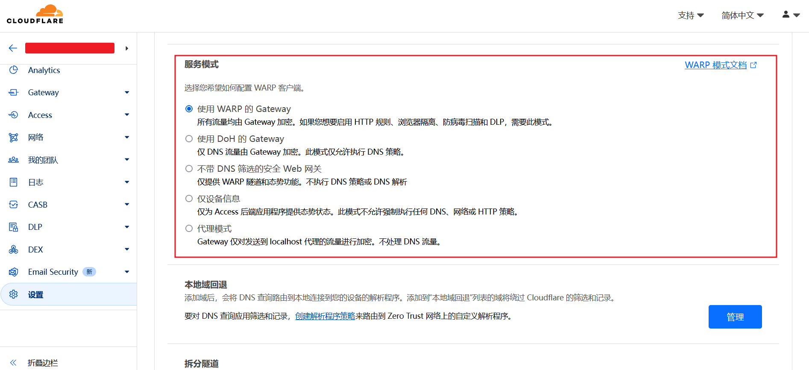
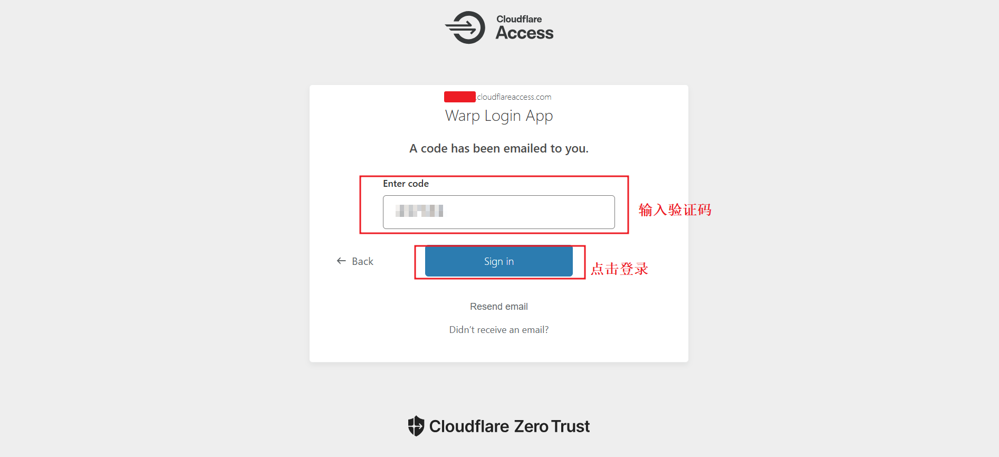

+++
title = "Cloudflare WARP 原生 IP"
weight = 11
# bookFlatSection = false
# bookToc = true
# bookHidden = false
# bookCollapseSection = false
# bookComments = false
# bookSearchExclude = false
+++

## Q & A

### 什么是原生 IP？
- 「原生 IP」：机房所在的实际地址和 IP 分配的归属地址是一致的。

---

### 为什么需要「原生 IP」？
- 因为部分网站是按照地区运营业务的，对网络要求更为严格，所以需要使用「原生 IP」才能访问，如：ChatGPT，Netflix 等。

---

### 为什么翻墙后还是访问不了？
- 因为 IDC 提供商的 IP 可能是从其他地区调配来的，翻墙服务器分配到的不是「原生 IP」，也有可能部分 IDC 提供商的 IP 被相关网站列入了黑名单，所以导致翻墙后还是访问不了相关的网站。

---

### 如何进一步解锁网络限制？
- 可以使用 Cloudflare WARP 解锁这些网站。
- 因为 WARP 客户端将设备的所有流量通过连接 Cloudflare 的最近数据中心进行代理，而 Cloudflare 的网络出口 IP 在绝大多数网站中都享有很高的信任度，其即便不是「原生 IP」，也会被识别为真实用户。且 WARP 免费无限流量。
- 简介可查看本站另一篇文章 [Cloudflare Zero Trust 简介 - Cloudflare WARP](/docs/cloudflare-zero-trust/#cloudflare-warp)


## 官方安装包

[WARP 官网](https://one.one.one.one/zh-Hans/)

WARP 官网提供了多平台的安装包：


## 为什么选择容器化安装呢？

- 安装简单，方便管理。
    - Cloudflare 官方只提供了 3 种 Linux 发行版的安装方法：Ubuntu、Debian、Red Hat Enterprise Linux & CentOS ，比容器安装麻烦，而其他 Linux 发行版安装会更麻烦。
- 容器化 WARP 开启“代理模式”简单。
    - 使用容器化隔离后，容器里面的 WARP 默认全局模式不用改变，会代理容器内的所有流量，所以转发到 WARP 容器的流量就会被 WARP 代理，这样 WARP 容器整体就可以看作是“代理模式”。
    - WARP 代理模式不处理 DNS 流量。[Cloudflare docs - WARP modes - Proxy mode](https://developers.cloudflare.com/cloudflare-one/connections/connect-devices/warp/configure-warp/warp-modes/#proxy-mode)
    - WARP 的代理模式可能有 bug，如 [discussion & solution](https://github.com/XTLS/Xray-core/issues/3913#issuecomment-2445677618)
## 第三方 WARP 镜像 warp-docker

因为 WARP 是作为 VPN 安装在个人用户设备上的，所以官方没有提供容器镜像。

这里选择使用 [warp-docker](https://github.com/cmj2002/warp-docker)
- 镜像打包的是官方版 WARP
- 启动容器后，默认提供 HTTP 和 SOCKS5 代理
- 文档详细，可根据需求自定义

## docker 安装 WARP 示例

### 示例目录结构

```shell
# 示例目录结构
# /root
# ├── warp-start-docker.sh
# └── warp
```

### Docker/Podman 安装 warp-docker 示例

下面是 Shell 脚本示例，可以保存成 `warp-start-docker.sh` 文件后运行。

{}

{}

```shell
#!/bin/bash

docker container stop warp
docker container rm warp

# /root/warp
# 替换成自己的路径
docker container run -d \
  --name=warp \
  --restart=always \
  --device-cgroup-rule='c 10:200 rwm' \
  -p 127.0.0.1:1080:1080 \
  -e WARP_SLEEP=5 \
  --cap-add=MKNOD \
  --cap-add=AUDIT_WRITE \
  --cap-add=NET_ADMIN \
  --sysctl net.ipv6.conf.all.disable_ipv6=0 \
  --sysctl net.ipv4.conf.all.src_valid_mark=1 \
  -v /root/warp:/var/lib/cloudflare-warp \
  docker.io/caomingjun/warp:latest

# 容器挂载此路径
# -v /root/warp:/var/lib/cloudflare-warp
# 会保存容器内 WARP 客户端的连接信息
# 下次启动容器，WARP 客户端会使用保存的信息连接
# 详细可查看文档 [warp-docker](https://github.com/cmj2002/warp-docker)
```

{}

{}

```shell
#!/bin/bash

podman container stop warp
podman container rm warp

# /root/warp
# 替换成自己的路径
podman container run -d \
  --name warp \
  --restart always \
  -p 127.0.0.1:1080:1080 \
  -e WARP_SLEEP=5 \
  --cap-add=NET_ADMIN \
  --device=/dev/net/tun \
  --sysctl net.ipv6.conf.all.disable_ipv6=0 \
  --sysctl net.ipv4.conf.all.src_valid_mark=1 \
  -v /root/warp:/var/lib/cloudflare-warp \
  docker.io/caomingjun/warp:latest

# 容器挂载此路径
# -v /root/warp:/var/lib/cloudflare-warp
# 会保存容器内 WARP 客户端的连接信息
# 下次启动容器，WARP 客户端会使用保存的信息连接
# 详细可查看文档 [warp-docker](https://github.com/cmj2002/warp-docker)
```

{}

{}

运行脚本命令：

```bash
bash /root/warp-start-docker.sh
```

容器启动后，尝试运行下面命令，看看容器是否连接成功：

```bash
curl --socks5-hostname 127.0.0.1:1080 https://cloudflare.com/cdn-cgi/trace
```

如果输出包含 warp=on 或 warp=plus，则容器工作正常。如果输出中包含 warp=off，则表示容器无法连接到 WARP 服务。

### 使用 Cloudflare Zero Trust 登录 WARP

容器启动后，WARP 默认连接是基础版流量。

我们可以根据官方文档使用 Cloudflare Zero Trust 登录 WARP。[Cloudflare - Cloudflare Zero Trust - Connect devices - WARP](https://developers.cloudflare.com/cloudflare-one/connections/connect-devices/warp/deployment/manual-deployment/#enroll-via-the-cli)

也可参考下方图文步骤。

### Hysteria 新增配置示例

基于 [Hysteria2 代理](/docs/hysteria2/) 已有的配置文件，添加新的配置：
- 将 Hysteria 代理的流量再次转发到刚刚启动的 warp 容器
- 配置了 127.0.0.1 的流量不会转发到 warp 容器，其他流量全部转发

> 注意：
>
> 因为示例 hy2 容器使用了参数 --network=host 启动，表示容器网络直接使用宿主机的 IP 地址和端口，而不是创建容器自己的隔离网络
>
> 所以可以在 hy2 容器内方便使用 127.0.0.1 直接访问宿主机服务资源

配置文件路径：`/root/hy2/config.yaml`

```yaml
# listen: :443 

tls:
  cert: /etc/hysteria/certs/fullchain.cer  # 替换成自己的证书，注意使用 fullchain.cer 证书
  key: /etc/hysteria/certs/example.com.key  # 替换成自己的密钥

auth:
  type: password
  password: 'your_password'  # 替换成自己的密码

masquerade: 
  type: proxy
  proxy:
    url: https://www.bing.com/
    rewriteHost: true

sniff:
  enable: true
  timeout: 2s
  rewriteDomain: false
  tcpPorts: 80,443,8000-9000
  udpPorts: all

# 新增 start
acl:
  inline:
    - direct(127.0.0.1)
    - warp(all)

outbounds:
  - name: warp
    type: socks5
    socks5:
      addr: 127.0.0.1:1080  # 和 warp 容器监听的端口保持一致

# 注意：因为示例 hy2 容器使用了参数 --network=host 启动，表示容器网络直接使用宿主机的 IP 地址和端口，而不是创建容器自己的隔离网络
# 所以可以在 hy2 容器内方便使用 127.0.0.1 直接访问宿主机服务资源

# 新增 end
```
## 使用 Cloudflare Zero Trust 登录 WARP 图文步骤

我们可以根据官方文档使用 Cloudflare Zero Trust 登录 WARP。

### 0. 管理 WARP 客户端设备注册（必须）

必须创建和添加策略：
- 因为只有在 `WARP 客户端设备注册页面` 添加策略后，且符合策略规则的用户，WARP 客户端才能认证成功以登录 Cloudflare Zero Trust。
- 新开通 Cloudflare Zero Trust，策略默认为空，所以必须先创建和添加策略。

如图，如果在 `WARP 客户端设备注册页面` 删除已经添加的所有策略，也会提示任何人无权访问。可以直接关闭取消删除或者添加新的规则策略。


0.1 进入 [Cloudflare](https://one.dash.cloudflare.com/) Zero Trust 管理面板，添加 `Access 策略`


> 注：email 策略是我之前创建的，请忽略。

0.2 添加具体策略

如图，这里 `策略名` 填写为 emails，`会话持续时间` 保持默认，使用 `Emails 选择器` 添加了一组邮件用户。


- 如何使用选择器可以查看文档 [Cloudflare Docs - Cloudflare Zero Trust - Access](https://developers.cloudflare.com/cloudflare-one/policies/access/)
    - 通常选择 `Emails`：例，you1@your_email.com，you2@your_email2.com
    - 或 `Emails ending in`：例，@your_email.com，@your_email2.com

- 会话持续时间文档介绍 [Cloudflare Docs - Cloudflare Zero Trust - Session management](https://developers.cloudflare.com/cloudflare-one/identity/users/session-management/)

- 关于 Access 简介也可查看本站另一篇文章 [Cloudflare Zero Trust 简介 - Cloudflare Access](/docs/cloudflare-zero-trust/#cloudflare-access)


滚动页面到最下方，点击保存后，自动跳转到策略页面，可以看到新添加的策略


0.3 管理 WARP 客户端设备注册

Zero Trust 管理面板 -> 设置 -> WARP 客户端 -> 设备注册 -> 管理


第 0.2 步骤添加了一个新策略，所以点击 `选择现有策略`


> 注：email 策略是我之前添加的，请忽略。

点击勾选策略，点击确定


WARP 客户端设备注册新策略已经添加成功


保存策略，滚动到页面最下面，点击保存


默认这里的策略是空的，谁也连不上。现在这里有了两个策略。

可以在 Access 页面创建任意策略，然后按需选择已创建的策略添加，然后只有符合添加的这些策略的用户，才可以使用 Cloudflare Zero Trust 登录 WARP。

0.4 管理 WARP 客户端设备设置

如图，WARP 客户端 `设备注册` 下面的 `设备设置`，本站示例仅使用默认配置，没有添加新配置文件。
- 因为我们使用容器安装 WARP，其容器内 WARP 默认全局模式会代理容器内所有流量，所以 WARP 容器整体就可以看作是“代理模式”，所以本站示例不需要添加新配置文件。


如图默认配置，WARP 服务模式是全局模式，会代理所有流量。


0.5 Cloudflare Zero Trust 团队名称

WARP 客户端登录 Cloudflare Zero Trust 需要填入 `团队名称`。

自己的 `团队名称`，可通过下面方式查看修改， Zero Trust 管理页 -> 左侧栏设置 -> 自定义页面 -> 团队域：


### 1. 图形界面 WARP 客户端使用 Cloudflare Zero Trust 登录

图形界面的操作系统，参考官方文档 [Cloudflare - Cloudflare Zero Trust - Connect devices - WARP](https://developers.cloudflare.com/cloudflare-one/connections/connect-devices/warp/deployment/manual-deployment/) 并按照 WARP 客户端提示填入 `团队名称` 登录 Cloudflare Zero Trust 即可，会自动跳转认证页面，并且认证成功后会自动登录。

### 2. 命令行界面 WARP 客户端使用 Cloudflare Zero Trust 登录

因为搭建梯子的 VPS 服务器只有命令行界面，所以需要**手动**注册、复制登录 token，WARP 才能成功连接 Zero Trust。

打开官方文档 [Cloudflare - Cloudflare Zero Trust - Connect devices - WARP - 命令行界面](https://developers.cloudflare.com/cloudflare-one/connections/connect-devices/warp/deployment/manual-deployment/#enroll-via-the-cli)，找到 `Troubleshoot missing registration` 这行，单击打开隐藏内容即可查看手动连接提示。


下面是容器内 WARP 登录 Cloudflare Zero Trust 的具体步骤。

2.1 进入容器
{}

{}

```bash
# warp 是前面示例启动的容器名
docker exec -it warp bash
```

{}

{}

```bash
# warp 是前面示例启动的容器名
podman exec -it warp bash
```

{}

{}

2.2 删除当前注册信息

```bash
warp-cli registration delete
```


2.3 注册自己的 Cloudflare Zero Trust 团队名称

若忘记了自己开通 Zero Trust 时填写的 `团队名称`，可参考第 0.5 步骤查看。

WARP 客户端注册 Cloudflare Zero Trust 团队：

```bash
# <your-team-name> 替换为自己的 团队名称
warp-cli registration new <your-team-name>
```

如图，客户端会询问一次是否同意用户协议：


同意用户协议，输入 `y`：


输入 `y` 后，按 `回车键`，如图，**复制输出的链接**


2.4 手动获取登录 token

用浏览器打开**复制的链接**，下图均以 Edge 浏览器示例：

如图，访问复制的链接会自动跳转到 Access 用户认证：
- 输入符合第 0.3 步骤中 Access 策略的用户
- 点击发送验证码


输入验证码，点击登录



跳转到 `Success` 登录成功页面
- 鼠标右键
- 然后点击 `查看页面源代码`


浏览器会打开一个源代码页面，然后按照下面操作复制登录 token：
- (1) `Ctrl + F` 打开浏览器的 `页面搜索`，
- (2) 输入 `url=com.cloudflare.warp://`，找到 `<meta http-equiv="refresh" content"=0;url=com.cloudflare.warp://<your-team-name>.cloudflareaccess.com/auth?token=yeooilknmasdlfnlnsadfojDSFJndf_kjnasdf..." />`，
- (3) 复制登录 token：**`com.cloudflare.warp://<your-team-name>.cloudflareaccess.com/auth?token=<your-token>`**


如下图，我把一整行复制出来后，我们需要复制的是**蓝色部分**，注意复制时，从 `=` 号后开始，到 `"` 号前结束，不要复制 `=` 号和 `"` 冒号（示例省略了中间内容）


如下，复制的 token 格式（示例省略了中间内容）

```bash
com.cloudflare.warp://<your-team-name>.cloudflareaccess.com/auth?token=eyJhbGciOiJSUzi......UMEGRp8TA
```

2.5 回到容器，使用复制的登录 token 注册 WARP 客户端：

```bash
warp-cli registration token com.cloudflare.warp://<your-team-name>.cloudflareaccess.com/auth?token=<your-token>
```
如图，打印 Success 表示成功。

若打印 Error 等其他信息，token 可能已经过期（或复制有误），可以从第 2.3 步重新生成登录 token，动作可以稍微快些防止过期。


2.6. WARP 客户端建立连接

```bash
warp-cli connect
```


2.7 退出容器

```bash
exit
```


2.8 测试 WARP

退出容器后，可以测试容器工作是否正常

```bash
curl --socks5-hostname 127.0.0.1:1080 https://cloudflare.com/cdn-cgi/trace
```

如果打印内容包括 `warp=on` 或 `warp=plus`，则容器工作正常。

### 3. 管理连接的 WARP 设备

3.1 Cloudflare Zero Trust 管理面板 -> 我的团队 -> 设备

所有连接的 WARP 设备都会在这里显示，并且可以撤销删除设备。


3.2 安装的 WARP 客户端，可以参考下面步骤查看设备信息

- 3.2.1 容器内查看 WARP 客户端当前设备名和设备 ID

进入容器

{}

{}

```bash
# warp 是前面示例启动的容器名
docker exec -it warp bash
```

{}

{}

```bash
# warp 是前面示例启动的容器名
podman exec -it warp bash
```

{}

{}

查看设备名（其实 `@` 符号后面就是 Linux 系统的设备名）

```bash
cat /etc/hostname
```

查看设备 ID

```bash
warp-cli registration show
```

这是刚刚连接成功的容器，可以看到和设备管理页面的信息是一致的。

退出容器

```bash
exit
```

- 3.2.2 Windows10 查看 WARP 客户端当前设备名和设备 ID

Windows10 系统的设备名，开始 -> 设置 -> 系统 -> 关于 -> 设备名称


Windows10 WARP 客户端，偏好设置 -> 常规 -> 设备 ID


