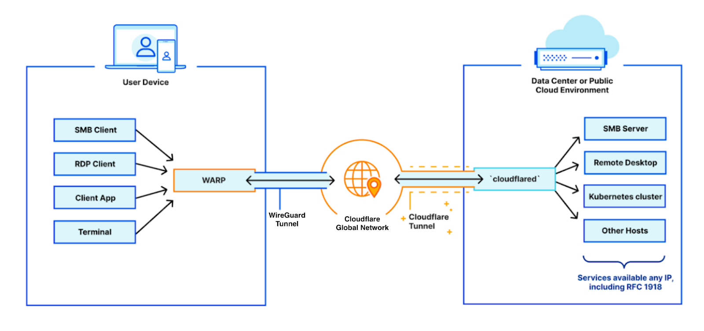
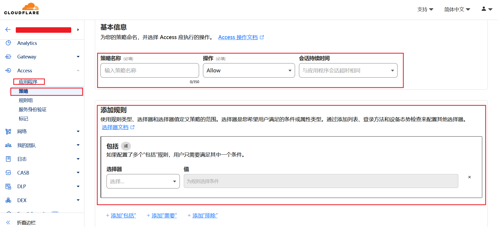
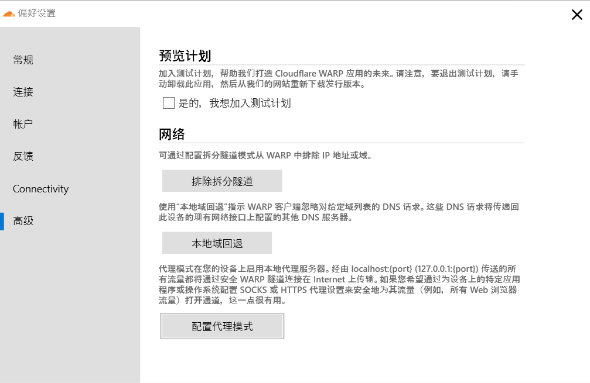
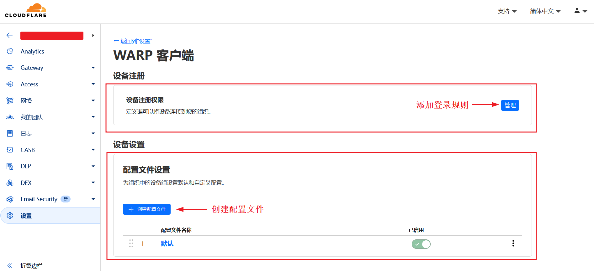
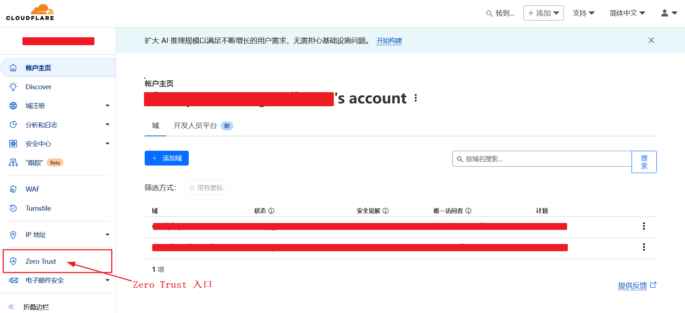
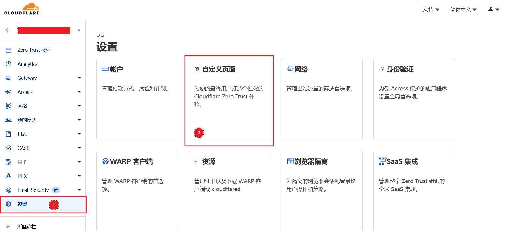
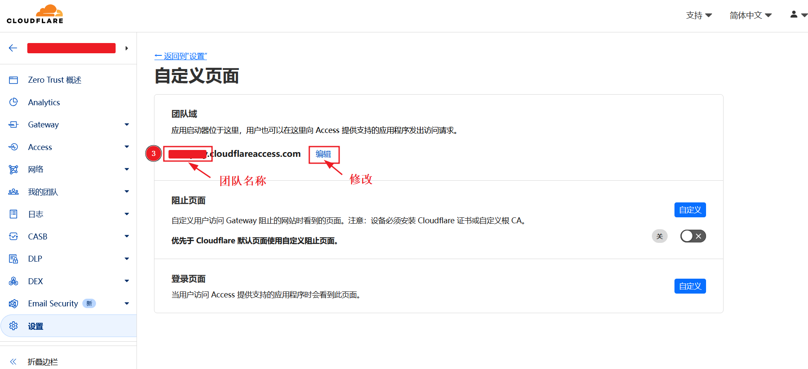

+++
title = "Cloudflare Zero Trust 简介"
weight = 10
# bookFlatSection = false
# bookToc = true
# bookHidden = false
# bookCollapseSection = false
# bookComments = false
# bookSearchExclude = false
+++

## 什么是 Zero Trust 安全

[Zero Trust 安全 | 什么是 Zero Trust 网络？](https://www.cloudflare.com/zh-cn/learning/security/glossary/what-is-zero-trust/)

Zero Trust 安全是一种 IT 安全模型，要求试图访问专用网络上资源的每一个人和每一台设备都必须进行严格的身份验证。

Zero Trust 架构不信任任何人和物。

对于自建梯子来说，这个 Zero Trust 安全模型不是重点，只需了解一下即可。要用的是 Cloudflare 推出的 Zero Trust 服务。

## Cloudflare Zero Trust

Cloudflare Zero Trust 是 Cloudflare 基于 Zero Trust 安全模型推出的一整套服务。

可以通过 Cloudflare Zero Trust 构建许多隔离的虚拟专用网络，其主要是使用 Cloudflare WARP 和 Cloudflare Tunnel 来构建虚拟化连接、Cloudflare Access 来设置访问权限，以及其他相关服务。
 

### Cloudflare Access

- 工作原理：Cloudflare Access 是一个 Zero Trust 网络解决方案，位于应用程序前端，确保只有经过授权的用户才能访问受保护的资源，并可以设置一次授权的有效期。
- 主要功能：
    - 细粒度访问控制：可以基于用户身份、组成员资格、设备类型等细粒度上下文来定义访问策略
    - 多因素身份验证 (MFA)：支持与多种身份提供商 (IdP) 集成，并可以强制执行多因素身份验证
    - 单点登录 (SSO)：为所有受保护的应用程序提供统一的登录体验
    - 无 VPN 访问：无需传统的 VPN 即可安全地访问内部应用程序

如图，创建 `Access 策略` 的页面，

- 如何使用选择器可以查看文档 [Cloudflare Docs - Cloudflare Zero Trust - Access](https://developers.cloudflare.com/cloudflare-one/policies/access/)
    - 通常选择 `Emails`：例，you1@your_email.com，you2@your_email2.com
    - 或 `Emails ending in`：例，@your_email.com，@your_email2.com

- 会话持续时间文档介绍 [Cloudflare Docs - Cloudflare Zero Trust - Session management](https://developers.cloudflare.com/cloudflare-one/identity/users/session-management/)
    - 除了如上图创建和管理 Access 策略时，设置 `策略会话持续时间`
    - 还可以在创建和管理应用程序时，设置 `应用程序会话持续时间`
    - 最后还有一个 `全局会话持续时间`

> 注：以下翻译总结自 Access 文档
>
> ① 有三种会话持续时间，可选时间范围从 `立即超时` 到 `1 个月` 不等：
> - 全局会话持续时间
>     - 默认值为 `应用程序会话持续时间`
>     - 在 Zero Trust 面板 -> 设置 -> 身份验证 -> 全局会话超时，可以修改
> - 应用程序会话持续时间
>     - 默认值为 24 小时
>     - 可以为自托管和私有 Access 应用程序，设置应用程序会话持续时间
>     - 在 Zero Trust 面板 -> Access -> 应用程序，可以创建和管理应用程序
> - 策略会话持续时间
>     - 默认值为 `应用程序会话持续时间`
>     - 如果为应用程序添加策略，则策略会话持续时间优先于应用程序会话持续时间
>     - 在 Zero Trust 面板 -> Access -> 策略，可以创建和管理策略
> 
> ② 会话持续时间具体实现
>
> 当用户登录到受 Access 保护的应用程序时，Access 会根据您的 Access 策略验证其身份，并生成两个签名的 JSON Web 令牌 （JWT）：
> 
> | 令牌  | 描述 | 有效期 | 存储 |
> |:---:|:---:|:---:|:---:|
> | 全局会话令牌 | 存储来自 IdP（Identity Provider，身份提供商）的用户身份，并为所有 Access 应用程序提供单点登录 （SSO） 功能。| 全局会话持续时间 | Cloudflare 团队域 |
> | 应用程序令牌 | 允许用户访问特定的 Access 应用程序。| 策略会话持续时间（如果已设置），否则为应用程序会话持续时间 | 受 Access 应用程序保护的主机名 |
>
> 全局令牌不能用于直接访问应用程序。
>
> 用户可以在应用程序令牌的整个生命周期内访问应用程序。
>
>当应用程序令牌过期时，如果全局令牌仍然有效（并且用户的身份仍然通过您的访问策略），Cloudflare 将自动颁发新的应用程序令牌。如果全局令牌也已过期，系统将提示用户使用 IdP（Identity Provider，身份提供商）重新进行身份验证。

### Cloudflare WARP

- 网络协议：WireGuard（默认）（可配置 MASQUE 协议，一般不用）
- 工作原理： WARP 客户端安装在用户的设备上，将设备的所有流量通过 Cloudflare 的全球网络进行代理。WARP 会连接到最近的 Cloudflare 数据中心，对流量进行加密，从而提高安全性和隐私性。
- 主要功能：
    - 安全连接： 加密设备和 Cloudflare 之间的连接，保护数据安全
    - 优化网络： 通过 Cloudflare 的全球网络，选择最佳路由，提高访问速度
    - 隐私保护： 隐藏用户的真实 IP 地址
- 代理模式：
    - 全局模式：默认模式，代理设备的所有流量
    - 代理模式：也可设置本地代理模式
        - 偏好设置 -> 高级 -> 配置代理模式，如图 Windows 版本

> 注意：
> WARP 代理模式
> - 仅 Windows, Linux, and macOS 版本可开启代理模式，且不处理 DNS 流量。[Cloudflare docs - WARP modes - Proxy mode](https://developers.cloudflare.com/cloudflare-one/connections/connect-devices/warp/configure-warp/warp-modes/#proxy-mode)
> - 部分版本可能有 bug，如 [discussion & solution](https://github.com/XTLS/Xray-core/issues/3913#issuecomment-2445677618)

WARP 作为一个 VPN，理论上，直接安装 WARP 就可以实现翻墙。不直接使用 WARP 翻墙是因为国内已经封的差不多了，根本用不了。

因为 WARP 会连接到最近的 Cloudflare 数据中心，根据这个特点，科学上网的 VPS 服务器可以通过 WARP 使用 Cloudflare 的原生 IP，以进一步解锁网络限制。

尽管 WARP 连接到的出口 IP 不一定是原生 IP，可能也是机房 IP，但由于 Cloudflare 的网络出口在绝大多数网站中都享有很高的信任度，因此都会被识别为真实用户。

### Cloudflare WARP 流量版本

- WARP：基础版，免费无限流量，基础的连接和优化
- WARP+ ：付费版，订阅制，更好的连接和优化
    - ~WARP+ 可以通过邀请码获得免费流量，已失效~
- WARP Zero Trust：需要注册开通 Cloudfalre Zero Trust，免费无限流量
    - 必须在 Zero Trust 管理页设置登录规则 Access 策略后，才能在 WARP 客户端登陆，否则任何人无权访问 [Cloudflare Docs - Zero Trust - WARP - First-time setup](https://developers.cloudflare.com/cloudflare-one/connections/connect-devices/warp/set-up-warp/)
    -  在 Zero Trust 管理页管理 WARP Zero Trust 客户端配置文件，有默认配置（本站自建梯子的示例仅使用默认配置，没有添加新配置） [Cloudflare Docs - Zero Trust - Configure WARP](https://developers.cloudflare.com/cloudflare-one/connections/connect-devices/warp/configure-warp/device-profiles/)
    - 可参考本站文章 [使用 Cloudflare Zero Trust 登录 WARP 图文步骤](/docs/cloudflare-warp/#使用-cloudflare-zero-trust-登录-warp-图文步骤)

如图，Cloudflare Zero Trust 面板 -> 设置 -> WARP 客户端

### Cloudflare Tunnel

- 网络协议：QUIC（默认）或 HTTP/2.0
- 工作原理： Tunnel 在用户的本地网络内部署一个 cloudflared 守护程序，建立一个到 Cloudflare 网络的出站连接。这个 Tunnel 将内网服务安全地暴露到公网，而无需开放任何入站端口。外部公网请求数据会通过 Cloudflare 转发到本地网络的 IP + Port。
- 主要功能：
    - 内网穿透： 将本地网络的服务（如 Web 服务器）暴露到公网，无需公网 IP
    - 隐藏网络服务：有公网 IP，网络服务也无需监听公网入站端口，以达到隐藏服务的目的
    - 安全访问： 所有流量都通过加密的 Tunnel 传输
    - HTTPS 支持： 自动为域名提供 HTTPS 认证，无需手动配置
    - Zero Trust 安全： 可以与 Cloudflare Access 集成，为服务添加额外的身份验证和授权

相当于一个反向代理。在配置界面可以查看支持的协议，目前可选：
- HTTP
- HTTPS
- UNIX
- TCP
- SSH
- RDP
- UNIX+TLS
- SMB
- HTTP_STATUS
- BASTION

## 注册 Cloudflare Zero Trust

- 要求
    - 已注册 Cloudflare 账号
    - 国际信用卡

> 实测国内银行发行的国际信用卡，也可以使用
> 

打开 [Cloudflare 面板](https://dash.cloudflare.com/)，左侧栏，点击 Zero Trust 进入：

第一次进入需要注册，按照提示填写一个 `团队名称`，选择 `免费套餐`，填写 `支付信息`。

填写完 `支付信息` 后，会有一次 $0.00 的支付验证。

如果不填 `支付信息`，大部分服务无法使用。

后续自己的 `团队名称`，可通过下面方式查看修改， Zero Trust 管理页 -> 左侧栏设置 -> 自定义页面 -> 团队域：

