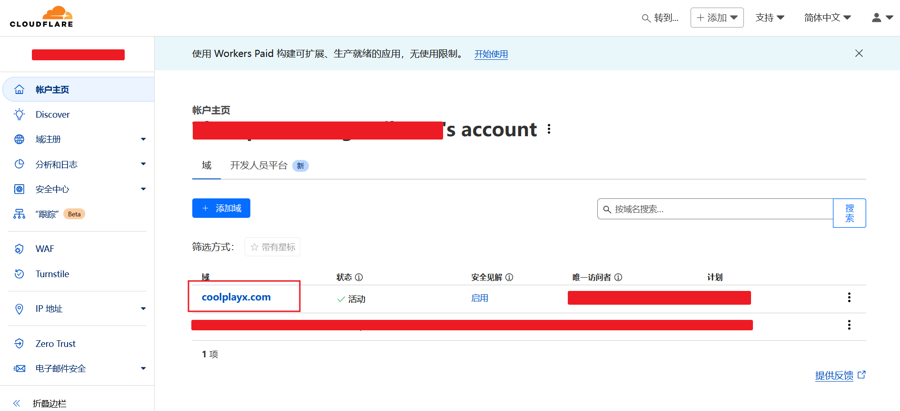
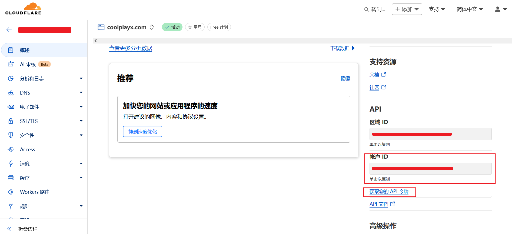
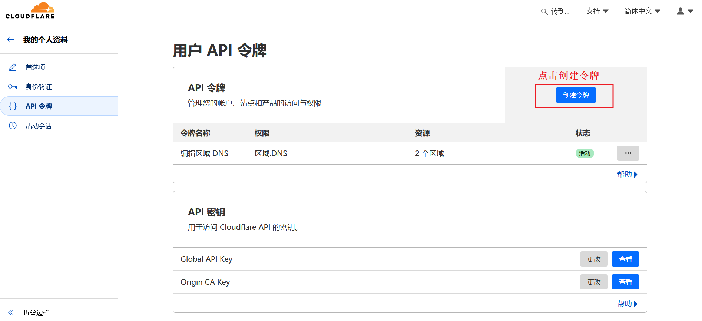
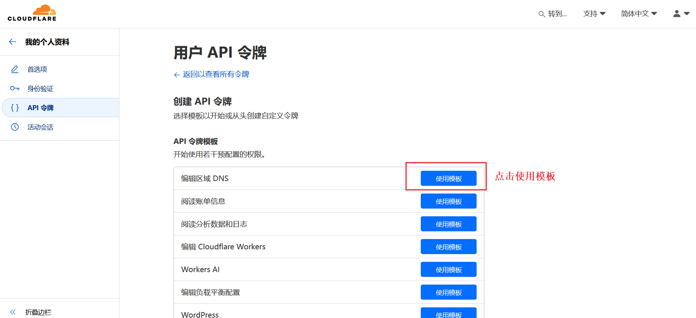
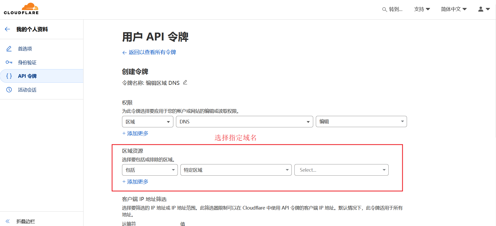
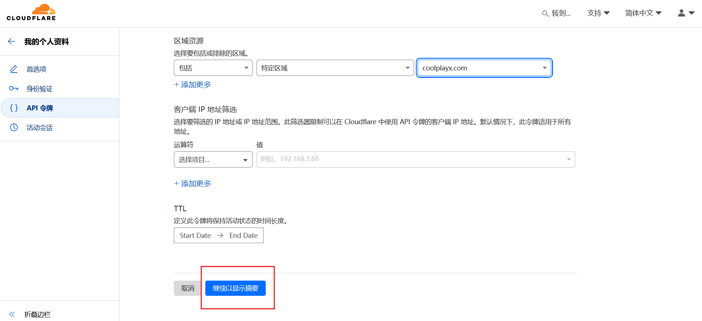
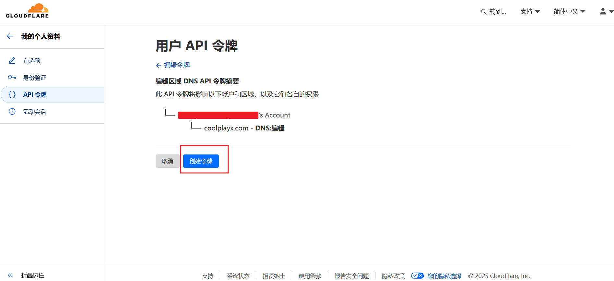
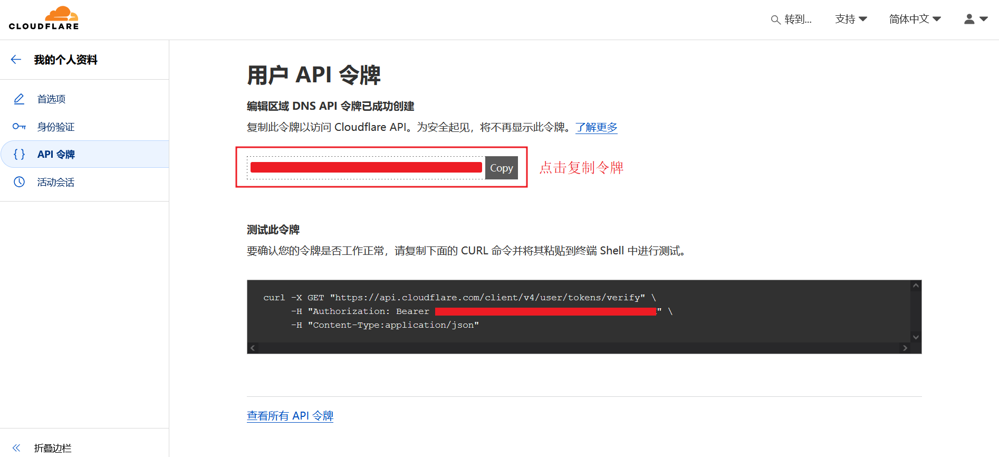

+++
title = "acme.sh 生成证书"
weight = 7
# bookFlatSection = false
# bookToc = true
# bookHidden = false
# bookCollapseSection = false
# bookComments = false
# bookSearchExclude = false
+++

传统的 SSL/TLS 证书申请过程比较繁琐，需要手动生成证书签名请求（CSR），然后提交给 CA 机构进行验证和颁发。

ACME 是一种用于自动化 SSL/TLS 证书管理的协议。它提供了一种标准化的方法，可以自动请求、验证和获取证书，无需手动干预。

- CA：证书颁发机构（Certificate Authority）
    - 负责发放和管理数字证书
- ACME：自动化证书管理环境（Automatic Certificate Management Environment）
    - 自动化 SSL/TLS 证书管理的协议
- acme.sh
    - 基于 Shell 脚本实现了 acme 协议的 ACME 客户端
    - 因为是 Shell 脚本，轻量化、命令行操作，所以非常适合个人或小型网站
    - 当然还有其他很多 ACME 客户端，这里不过多介绍

## 免费证书 CA

Let's Encrypt 和 ZeroSSL 均提供免费证书。

### Let's Encrypt

Let's Encrypt([https://letsencrypt.org/](https://letsencrypt.org/)) 是非营利性证书颁发机构，免费提供 SSL/TLS 证书。支持 ACME 协议，申请的证书有效期为 90 天。

Let's Encrypt 可以说是世界上最大的证书颁发机构，得到了各种托管服务商的广泛支持，非常适合自动化部署。

若没有商业化要求或其他特殊需求，首选 Let's Encrypt。

### ZeroSSL

ZeroSSL([https://zerossl.com/](https://zerossl.com/)) 是一家商业化公司，但也免费提供 SSL/TLS 证书。支持 ACME 协议，生成的免费证书同样是 90 天。基于 ACME 申请免费证书不限制数量，也不需要到官网注册。

如果选择 ZeroSSL，通常建议到官网注册一个账号使用，因为作为商业公司，ZeroSSL 提供了 WEB 网页方便用户来管理证书。同时可以选择证书有效期的付费选项和附加功能。

ZeroSSL 除了提供免费的域名证书，还提供免费的 IP 证书，但免费 IP 证书服务需要注册账号，且不支持 ACME。

- 生成免费 IP 证书要求
    - 需注册账号，按照提示手动申请
    - 不会为保留的 IP 地址颁发证书
    - 仅支持 HTTP 验证
    - 有效期 90 天

## acme.sh 生成证书

[acme.sh](https://github.com/acmesh-official/acme.sh)

[acme.sh 中文说明](https://github.com/acmesh-official/acme.sh/wiki/%E8%AF%B4%E6%98%8E)

### 安装 acme.sh

根据官方文档，安装 acme.sh。

因为 acme.sh 被 ZeroSSL 收购，其于 2021 年 7 月 21 日在文档中明确说明默认 CA 服务器是 ZeroSSL。

如果需要把默认 CA 服务器改成 Let's Encrypt，可以执行如下命令：

{}

{}

```shell
#!/bin/bash

~/.acme.sh/acme.sh --set-default-ca --server letsencrypt
```

{}

{}
```shell
#!/bin/bash

~/.acme.sh/acme.sh --set-default-ca --server zerossl
```
{}

{}

### 生成证书

acme.sh 实现了 acme 协议支持的所有验证协议。

一般有两种方式验证: HTTP 和 DNS 验证。

使用 HTTP 验证，需要保证服务器 80（默认值） 端口是空闲的，或者使用 Nginx、Apache 等 Web 服务监听 80 端口，而且要保证从外部网络可以访问，所以不太方便。

如开启了防火墙，或者在 Cloudflare 开启了严格策略的 CDN 代理，导致 CA 服务器无法连接到自己服务器的 80 端口，此时 HTTP 验证就会失败。

所以为了方便，建议使用 DNS 验证，这种方式只需要保证当前申请证书的服务器可以连接外部网络即可。

下面是使用 Cloudflare DNS 验证生成证书的脚本示例，一定要替换成自己的信息：
```shell
#!/bin/bash

# cloudflare dns
# 替换成自己的 cloudflare 信息
export CF_Token="your_token"
export CF_Account_ID="your_account_id"

# 生成证书
# example.com
# 替换成自己的域名
~/.acme.sh/acme.sh \
--issue \
-d example.com \
--keylength ec-256 \
--force \
--dns dns_cf

# 安装证书
# example.com
# 替换成自己的域名
# your_path
# 替换成自己的安装路径
~/.acme.sh/acme.sh \
--install-cert \
-d example.com \
--ecc \
--fullchain-file /your_path/fullchain.cer \
--ca-file /your_path/ca.cer \
--cert-file /your_path/example.com.cer \
--key-file /your_path/example.com.key
```

### fullchain.cer 和 example.com.cer 的区别

- example.com.cer
    - 这个文件仅包含服务器证书，不包含任何中间证书。
    - 此证书是域名所对应的证书，包含了公钥和元数据，如颁发者、序列号、主题、SAN、属性和扩展等。
- fullchain.cer
    - 这个文件包含了服务器证书（example.com.cer）以及所有必需的中间证书和根证书，形成一个完整的证书链。
    - 是 example.com.cer 和 ca.cer (CA 证书) 的拼接。

大多数 Web 服务器（如 Nginx）需要使用 fullchain.cer。

## 获取 Cloudflare 信息图文步骤

[acme.sh dns_cf 文档](https://github.com/acmesh-official/acme.sh/wiki/dnsapi#dns_cf)

① 进入 [Cloudflare 面板页](https://dash.cloudflare.com/)，点击域名进入管理页


② 域名页面，右侧向下滚动页面


根据 acme.sh 文档说明，Zone ID 用于单个域名，Account ID 用于多个域名。

这里直接使用 Account ID 即可，复制替换脚本中的参数 `CF_Account_ID="your_account_id"`。

③ 点击进入 API 令牌页面，创建令牌


使用 `编辑区域 DNS` 模板


选择域名，可以添加多个


添加完成，滚动到页面底部，点击继续


创建令牌


复制令牌替换脚本中的参数 `CF_Token="your_token"`。


## 关于 Cloudflare Accout/Zone ID

Account/Zone ID 是不能更改的，但 Cloudflare 将 Accout/Zone ID 设计成了不敏感信息，不小心公开了也是安全的，当然尽量不要公开。

讨论链接 [comment](https://github.com/cloudflare/wrangler-legacy/issues/209#issuecomment-541654484)
> as per our security team, it's completely Fine to have your zone_id and account_id public, the Global API key and associated email address should be kept secret.

> 如果一定要更改 Account/Zone ID，Zone ID 可以尝试先删除域名，再添加域名达到更改的目的。Account ID 想改估计只能重新注册账号了。如果绑定了很多业务，估计会很麻烦，因为是不敏感信息，其实泄露了也没啥。需要关注的应该是 API 令牌的安全。 

API 令牌如果泄露了，一定要记得删除，再重新生成一个新的。尽量不要使用全局 API 令牌，因为权限太高，当然全局令牌也是可更改的。