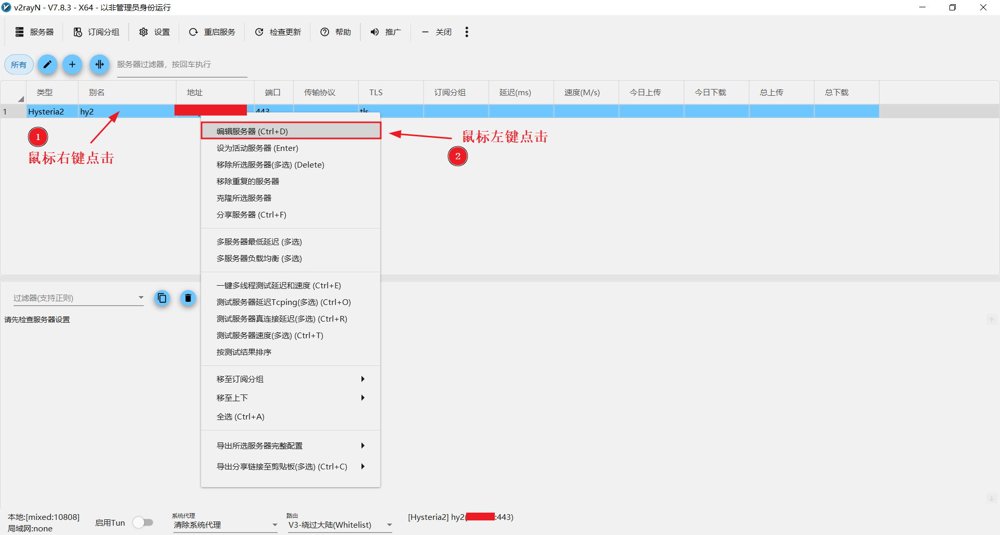

+++
title = "客户端"
weight = 12
# bookFlatSection = false
# bookToc = true
# bookHidden = false
# bookCollapseSection = false
# bookComments = false
# bookSearchExclude = false
+++

代理客户端，有非常多的图形化项目，不过用过的比较少，只知道 v2rayN 系列和 clash 系列，而且前者用的比较多。

最开始都是手写配置文件，直接在命令行启动代理工具的客户端模式，但使用起来会比较麻烦。

因为相关的图形客户端用过的较少，也就不做横向对比了。

这里只简单说下自己常用的 v2rayN 解决了哪些手动管理时的麻烦：
1. 自带默认路由规则集，无需额外配置
    - 手写分流基本够用，但项目的默认规则集会持续维护并支持一键导入
2. 添加自定义服务器节点后，也可使用默认路由规则，且设置步骤简单
    - 兼顾了自定义和分流规则
3. 开机自启
    - 点击 v2rayN 设置即可开机自启
4. 便于分享
    - 大多数朋友更能接受图形化客户端
5. 对流行代理工具内核的支持非常积极
    - 某种程度上可以当作代理工具 Core 的管理器
6. v2rayN 一键 Tun 代理模式
    - 方便开启/关闭“全局透明代理”

> 注1：
>
> “全局透明代理”：通常指操作系统应用程序层面，相关工具会自动处理所有网络请求，将其他所有应用程序的流量重定向到代理客户端，代理客户端处理分流后发出。
>
> - v2rayN 支持一键启动 Tun 的方式代理系统全局 TCP/UDP 流量
>     - Tun：跨平台的透明代理解决方案，在系统中创建虚拟网卡，利用系统路由功能来捕获及重定向流量
>
> “网关透明代理”：通常指局域网设备层面，在局域网的网关搭建相关代理工具，会自动处理局域网内所有设备的网络请求。
>
> - 通常需要在局域网的主路由器或其他设备上搭建代理客户端和流量转发，以实现对局域网所有设备的“透明代理”

> 注2：
>
> 一般代理工具的“透明代理”不同于常规的三层 VPN 技术（如 WireGuard、OpenVPN），代理工具的“透明代理”通常只处理 TCP 和 UDP 流量，不支持 ICMP 等其它协议（不支持 ping 等命令）。
>
> VPN（虚拟专用网络）解决的是不同局域网之间设备互联和加密通信等问题。
> - 可以把 VPN 视为一个虚拟网关，不处理应用层面的数据
> - 可以简单认为设备之间互通使用网络层 IP 协议，所以 VPN 要实现网关功能，只需处理 IP 协议，所以那些基于 IP 协议的流量 VPN 都能处理
>
> 代理工具要解决的是规避访问限制和网络优化等问题。
> - 涉及到访问分流、游戏加速等，这些需要应用程序访问的域名、特定客户端等应用层面的信息
> - 可以简单认为应用层通信使用传输层 TCP/UDP 协议，所以代理工具要拿到这些特殊信息，需要处理的是 TCP/UDP 协议
> - 所以一般代理工具只实现了 TCP/UDP 协议代理的能力，所以代理工具的“透明代理”不同于 VPN，只能处理 TCP 和 UDP 流量
>
> 以上仅作为 “VPN” 和 “代理工具”之间简单区分的描述。相关网络知识可查询“OSI 七层网络模型”（或“TCP/IP 四层网络模型”）和 "VPN" 及"代理工具"的实现原理等。

> 注3：
>
> 因没有苹果设备的实际使用经验，在这里列举 Shadowrocket，是因为只知道这个软件，并且好评率还算不错。
>
> 使用苹果设备的朋友，可能要多注意一下相关问题。

## 电脑设备

### Windows 10、macOS、Linux

#### [v2rayN](https://github.com/2dust/v2rayN)

## 移动设备

### Android

#### [v2rayNG](https://github.com/2dust/v2rayNG)

### iPhone

#### [Shadowrocket](https://apps.apple.com/us/app/shadowrocket/id932747118)

### iPad

#### [Shadowrocket](https://apps.apple.com/us/app/shadowrocket/id932747118)

## v2rayN 三种代理模式

### 1. 本地监听代理端口号

默认监听 10808 端口，混合支持 SOCKS 和 HTTP 代理协议
- 旧版本默认监听 10808 和 10809 端口，分别支持 SOCKS 和 HTTP 协议

其他程序使用此代理模式，需要手动设置：
- socks5://127.0.0.1:10808
- http://127.0.0.1:10808（旧版 http://127.0.0.1:10809）

### 2. Tun 代理模式

实现全局代理/透明代理，在系统中创建虚拟网卡，利用系统路由功能来捕获及重定向流量，默认代理系统所有 IPv4 的 TCP/UDP 流量
- 需要管理员权限
    - 右键通过管理员身份运行 v2rayN.exe，可以直接开启
    - 非管理员身份运行 v2ray.exe，第一次点击开启会申请管理员权限，同意后 v2ray.exe 自动重启以管理员身份运行，需再次点击开启
- 开启 Tun 时，v2rayN **默认关闭**本地监听代理端口号
    - 此时`设置本地代理端口号的程序`，无法网络连接（可手动关闭应用程序设置的代理）
    - 若开启了 `系统代理模式`，则`使用系统代理的程序`，无法网络连接（可关闭系统代理模式）
- 主界面 -> 设置 -> 参数设置 -> Tun 模式设置 -> **启用额外**监听端口
    - 开启 Tun 时，会同时监听本地代理端口
    - 此时，Tun 模式可以和其他两种模式混用
    - 但不建议 Tun 模式和其他两种模式混用

### 3. 系统代理模式

v2rayN 会自动开/关操作系统的代理功能。并将系统代理指向本地监听代理端口号。
- 操作系统的代理功能，不会代理所有应用程序
- 应用程序需要主动实现相关功能或开启相关选项，才能使用操作系统的代理功能，如 Edge 浏览器会调用系统代理

Windows 代理，默认关闭且为空：
- v2rayN 的 `PAC 模式` 会开启代理脚本模式
- v2rayN 的 `自动配置系统代理` 会开启代理服务器模式


#### 3.1 自动配置系统代理

- 每次启动/重启服务的时候，强制设定操作系统的代理


#### 3.2 PAC 模式

- 每次启动/重启服务的时候，强制设定 Windows 操作系统使用脚本。根据 PAC 文件中的内容，Direct 走本地网络；PROXY 转发流量给代理客户端


#### 3.3 清除系统代理

- 每次启动/重启服务的时候，强制把操作系统的代理清除掉


#### 3.4 不改变系统代理

- 每次启动/重启服务的时候，什么都不做，操作系统代理的设置保持不变

## Windows v2rayN 基本图文步骤

### 1. 下载

#### 1.1 进入主页

[v2rayN](https://github.com/2dust/v2rayN) 仓库主页，找到 `Releases` 发布页面，点击进入


#### 1.2 下载资源包

在发布页面，下载已打包好的 `Assets` 资源，Windows 平台推荐选择 `v2rayN-windows-64-SelfContained.zip`，不需要再安装其他依赖


### 2. 安装

解压下载好的压缩包 `v2rayN-windows-64-SelfContained.zip`

把解压出来的文件夹 `v2rayN-windows-64-SelfContained` 手动剪切复制到自己喜欢的目录

- 这里作为演示直接放到了桌面


### 3. 运行

打开 `v2rayN-windows-64-SelfContained` 文件夹，运行 `v2rayN.exe`


### 4. 添加代理服务器节点

#### 4.1 选择服务器节点

v2rayN 运行后，在 `主界面` -> `服务器` -> `添加[Hysteria2]服务器`
- 本站示例已搭建好了 Hysteria2 服务器
- 可根据实际代理，选择添加对应的服务器


#### 4.2 填写服务器信息

4.2.1 填写 Hysteria2 服务器信息，点击确定保存
- **替换为自己的信息**
- 第一次保存后可能无法连接，需再次编辑保存一次，可见下一步


4.2.2 **保存返回主界面后，若没有自动连接，可再次进入编辑页面重新确定保存一下**：

主界面成功添加的服务器，右键编辑服务器再次打开编辑页面



4.2.3 编辑页面右上角这次会自动选择 `Core` 核心，再次确定保存


#### 4.3 服务器自动连接成功

主界面，服务器自动连接成功，主界面最下面是基本信息，从左到右依次为：
- 三种代理模式：
    - 本地监听代理端口号
    - Tun 代理模式
    - 系统代理模式
- 路由规则
- 基本信息


### 5. 手动连接或切换代理节点

若没有自动连接，或想选择其他服务器节点，可手动右键 `设为活动服务器`
- 或者：主界面 -> 设置 -> 参数设置 -> v2rayN 设置 -> 主界面双击设为活动服务器


### 6. 查看和设置参数

进入设置页面


本地混合监听端口
- 混合协议为 HTTP 和 SOCKS
- 监听端口号 10808


### 7. 其他应用程序使用代理

下面是以 v2rayN 仅使用监听模式为基础，设置其他应用程序使用代理。

#### 7.1 Firefox 浏览器

Firefox 浏览器菜单栏 -> 设置 -> 常规 -> 网络设置 -> 填写代理客户端信息


或者和 Chrome 浏览器一样使用 SwitchyOmega 插件，可以管理多个代理信息。

#### 7.2 Chrome 浏览器

Chrome 浏览器（Firefox 也可用）可以使用插件 SwitchyOmega 管理代理设置。
- [SwitchyOmega 仓库主页](https://github.com/FelisCatus/SwitchyOmega)
- [SwitchyOmega 主页 - 最新 SwitchyOmega 使用教程快速入门篇](https://switchyomega.org/)


#### 7.3 其他桌面应用或命令行工具

本站可查看：
- [SSH 配置 Natcat(nc)/Nmap(ncat) 使用代理](/docs/ssh-configure-netcat_nc_nmap_ncat-to-use-proxy/)
- [Git HTTP/S 协议使用代理](/docs/git-use-proxy/)

其他应用程序可以根据相关文档设置使用代理。

## Windows v2rayN 添加自定义服务节点

### 0. 下载 v2rayN 支持的代理工具 Core 核心

查看 [发布文件介绍 - Windows](https://github.com/2dust/v2rayN/wiki/Release-files-introduction#windows-x64)，寻找核心列表下载链接和支持的核心
- 或者其他 Core 你可以从 [这里](https://github.com/2dust/v2rayN-core-bin/blob/master/v2rayN-windows-64-other-bins.zip)（v2rayN 提供的合集，里面的 Core 不一定最新）下载后放入 bin 文件夹

### 1. 自定义客户端配置文件

创建代理工具客户端配置文件，并自定义配置。

如下，hysteria2 客户端配置文件，示例路径 `d:\Desktop\hy2-client\config.yaml`

配置文件定义了：
- socks5 1080 入口
- http 1081（或 1080）入口（从 2.4.1 版本开始，Hysteria 客户端支持单端口同时支持 SOCKS5 和 HTTP 代理）
- 本地转发入口，27003，8080

自定义配置，所有端口不要和 v2rayN 端口（默认 10808 - 10813 都有用）一样，也不要和操作系统其他服务占用的端口一样。

{}

{}

```yaml
server: example.com:443 # 替换为自己的域名

auth: 'your_password' # 替换成自己的密码 

socks5:
  listen: 127.0.0.1:1080 

# 或 1080 #（从 2.4.1 版本开始，Hysteria 客户端支持单端口同时支持 SOCKS5 和 HTTP 代理）
http:
  listen: 127.0.0.1:1081

# 本地转发
tcpForwarding:
  - listen: 127.0.0.1:27003
    remote: 127.0.0.1:27003
  - listen: 127.0.0.1:8080
    remote: 127.0.0.1:8080
```

{}

{}

### 2. 添加自定义服务节点

在主界面 -> 服务器 -> 添加自定义配置服务器

[文档 - 添加自定义配置服务器](https://github.com/2dust/v2rayN/wiki/Description-of-some-ui#%E6%B7%BB%E5%8A%A0%E8%87%AA%E5%AE%9A%E4%B9%89%E9%85%8D%E7%BD%AE%E6%9C%8D%E5%8A%A1%E5%99%A8)

如下图，填写自定义配置服务器的信息，点击 `浏览` 导入配置文件，示例路径为 `d:\Desktop\hy2-client\config.yaml`
- **Socks 端口**：根据填写的端口号启动一个前置服务，提供 v2rayN **分流**和速度显示等功能
    - 自定义配置文件中，哪个端口是用作本地代理的，就填对应的端口号
    - 对应的协议必须是 socks5 代理，示例为 1080 端口
- v2rayN 将使用 Xray 或 sing-box(Tun) 启动前置服务
- 此前置服务会根据 v2rayN 的配置启动
    - 本地监听的代理端口号，就是 v2rayN 默认的本地监听端口号
    - 分流也会使用 v2rayN 的路由规则集


如下，各端口间的关系示意图：
- 应用程序可以连接前置代理，会经过一次前置代理 v2rayN 分流，再经过自定义配置分流
- 也可以直接连接自定义代理，但只会经过自定义配置分流
- hysteria2 client 没有分流配置，但使用其他核心可以自定义路由规则

<div class="mxgraph" style="max-width:100%;border:1px solid transparent;" data-mxgraph="{&quot;highlight&quot;:&quot;#0000ff&quot;,&quot;nav&quot;:true,&quot;resize&quot;:true,&quot;dark-mode&quot;:&quot;auto&quot;,&quot;toolbar&quot;:&quot;zoom layers tags lightbox&quot;,&quot;edit&quot;:&quot;_blank&quot;,&quot;xml&quot;:&quot;&lt;mxfile host=\&quot;Electron\&quot; agent=\&quot;Mozilla/5.0 (Windows NT 10.0; Win64; x64) AppleWebKit/537.36 (KHTML, like Gecko) draw.io/26.0.9 Chrome/128.0.6613.186 Electron/32.2.5 Safari/537.36\&quot; version=\&quot;26.0.9\&quot;&gt;\n  &lt;diagram name=\&quot;第 1 页\&quot; id=\&quot;bzfgrg-IFK-olNESicJM\&quot;&gt;\n    &lt;mxGraphModel dx=\&quot;2704\&quot; dy=\&quot;629\&quot; grid=\&quot;1\&quot; gridSize=\&quot;10\&quot; guides=\&quot;1\&quot; tooltips=\&quot;1\&quot; connect=\&quot;1\&quot; arrows=\&quot;1\&quot; fold=\&quot;1\&quot; page=\&quot;1\&quot; pageScale=\&quot;1\&quot; pageWidth=\&quot;827\&quot; pageHeight=\&quot;1169\&quot; math=\&quot;0\&quot; shadow=\&quot;0\&quot;&gt;\n      &lt;root&gt;\n        &lt;mxCell id=\&quot;0\&quot; /&gt;\n        &lt;mxCell id=\&quot;1\&quot; parent=\&quot;0\&quot; /&gt;\n        &lt;mxCell id=\&quot;c_paDSeY0DVcX9Myy4UQ-7\&quot; value=\&quot;需要代理的软件\&quot; style=\&quot;container=1;collapsible=0;expand=0;recursiveResize=0;html=1;whiteSpace=wrap;strokeColor=#FA4D56;fillColor=none;dashed=1;dashPattern=1 3;strokeWidth=2\&quot; vertex=\&quot;1\&quot; parent=\&quot;1\&quot;&gt;\n          &lt;mxGeometry x=\&quot;-800\&quot; y=\&quot;780\&quot; width=\&quot;238.77\&quot; height=\&quot;120\&quot; as=\&quot;geometry\&quot; /&gt;\n        &lt;/mxCell&gt;\n        &lt;mxCell id=\&quot;c_paDSeY0DVcX9Myy4UQ-8\&quot; value=\&quot;前置代理&amp;lt;div&amp;gt;Xray/sing-box(T&amp;lt;span style=&amp;quot;background-color: transparent; color: light-dark(rgb(0, 0, 0), rgb(255, 255, 255));&amp;quot;&amp;gt;un&amp;lt;/span&amp;gt;&amp;lt;span style=&amp;quot;background-color: transparent; color: light-dark(rgb(0, 0, 0), rgb(255, 255, 255));&amp;quot;&amp;gt;)&amp;lt;/span&amp;gt;&amp;lt;/div&amp;gt;\&quot; style=\&quot;container=1;collapsible=0;expand=0;recursiveResize=0;html=1;whiteSpace=wrap;strokeColor=#FA4D56;fillColor=none;dashed=1;dashPattern=1 3;strokeWidth=2\&quot; vertex=\&quot;1\&quot; parent=\&quot;1\&quot;&gt;\n          &lt;mxGeometry x=\&quot;-800\&quot; y=\&quot;610\&quot; width=\&quot;238.77\&quot; height=\&quot;120\&quot; as=\&quot;geometry\&quot; /&gt;\n        &lt;/mxCell&gt;\n        &lt;mxCell id=\&quot;c_paDSeY0DVcX9Myy4UQ-11\&quot; value=\&quot;&amp;lt;span style=&amp;quot;text-wrap: wrap;&amp;quot;&amp;gt;socks5://127.0.0.1:10808&amp;lt;/span&amp;gt;&amp;lt;div&amp;gt;&amp;lt;span style=&amp;quot;text-wrap: wrap;&amp;quot;&amp;gt;http://127.0.0.1:10808&amp;lt;/span&amp;gt;&amp;lt;/div&amp;gt;\&quot; style=\&quot;fillColor=#FA4D56;shape=mxgraph.ibm_cloud.group--resource;strokeColor=none;dashed=0;outlineConnect=0;html=1;labelPosition=center;verticalLabelPosition=bottom;verticalAlign=top;part=1;movable=1;resizable=1;rotatable=1;deletable=1;editable=1;locked=0;connectable=1;\&quot; vertex=\&quot;1\&quot; parent=\&quot;c_paDSeY0DVcX9Myy4UQ-8\&quot;&gt;\n          &lt;mxGeometry x=\&quot;20\&quot; y=\&quot;48\&quot; width=\&quot;24\&quot; height=\&quot;24\&quot; as=\&quot;geometry\&quot; /&gt;\n        &lt;/mxCell&gt;\n        &lt;mxCell id=\&quot;c_paDSeY0DVcX9Myy4UQ-16\&quot; value=\&quot;v2rayN&amp;lt;div&amp;gt;&amp;lt;div&amp;gt;分流&amp;lt;/div&amp;gt;&amp;lt;/div&amp;gt;\&quot; style=\&quot;container=1;collapsible=0;expand=0;recursiveResize=0;html=1;whiteSpace=wrap;strokeColor=#FA4D56;fillColor=none;dashed=1;dashPattern=1 3;strokeWidth=2\&quot; vertex=\&quot;1\&quot; parent=\&quot;c_paDSeY0DVcX9Myy4UQ-8\&quot;&gt;\n          &lt;mxGeometry x=\&quot;180\&quot; y=\&quot;35\&quot; width=\&quot;58.77\&quot; height=\&quot;50\&quot; as=\&quot;geometry\&quot; /&gt;\n        &lt;/mxCell&gt;\n        &lt;mxCell id=\&quot;c_paDSeY0DVcX9Myy4UQ-12\&quot; value=\&quot;v2rayN 自定义节点&amp;lt;div&amp;gt;(hysteria2 client config.yaml)&amp;lt;/div&amp;gt;\&quot; style=\&quot;container=1;collapsible=0;expand=0;recursiveResize=0;html=1;whiteSpace=wrap;strokeColor=#FA4D56;fillColor=none;dashed=1;dashPattern=1 3;strokeWidth=2\&quot; vertex=\&quot;1\&quot; parent=\&quot;1\&quot;&gt;\n          &lt;mxGeometry x=\&quot;-413\&quot; y=\&quot;710\&quot; width=\&quot;350\&quot; height=\&quot;295\&quot; as=\&quot;geometry\&quot; /&gt;\n        &lt;/mxCell&gt;\n        &lt;mxCell id=\&quot;c_paDSeY0DVcX9Myy4UQ-15\&quot; value=\&quot;自定义配置&amp;lt;div&amp;gt;分流&amp;lt;/div&amp;gt;\&quot; style=\&quot;container=1;collapsible=0;expand=0;recursiveResize=0;html=1;whiteSpace=wrap;strokeColor=#FA4D56;fillColor=none;dashed=1;dashPattern=1 3;strokeWidth=2\&quot; vertex=\&quot;1\&quot; parent=\&quot;c_paDSeY0DVcX9Myy4UQ-12\&quot;&gt;\n          &lt;mxGeometry x=\&quot;280\&quot; y=\&quot;105\&quot; width=\&quot;70\&quot; height=\&quot;50\&quot; as=\&quot;geometry\&quot; /&gt;\n        &lt;/mxCell&gt;\n        &lt;mxCell id=\&quot;c_paDSeY0DVcX9Myy4UQ-4\&quot; value=\&quot;&amp;lt;span style=&amp;quot;text-wrap: wrap;&amp;quot;&amp;gt;本地转发 127.0.0.1:27003&amp;lt;/span&amp;gt;\&quot; style=\&quot;fillColor=#FA4D56;shape=mxgraph.ibm_cloud.group--resource;strokeColor=none;dashed=0;outlineConnect=0;html=1;labelPosition=center;verticalLabelPosition=bottom;verticalAlign=top;part=1;movable=1;resizable=1;rotatable=1;deletable=1;editable=1;locked=0;connectable=1;\&quot; vertex=\&quot;1\&quot; parent=\&quot;c_paDSeY0DVcX9Myy4UQ-12\&quot;&gt;\n          &lt;mxGeometry x=\&quot;53\&quot; y=\&quot;220\&quot; width=\&quot;24\&quot; height=\&quot;24\&quot; as=\&quot;geometry\&quot; /&gt;\n        &lt;/mxCell&gt;\n        &lt;mxCell id=\&quot;c_paDSeY0DVcX9Myy4UQ-9\&quot; value=\&quot;&amp;lt;span style=&amp;quot;text-wrap: wrap;&amp;quot;&amp;gt;本地转发 127.0.0.1:8080&amp;lt;/span&amp;gt;\&quot; style=\&quot;fillColor=#FA4D56;shape=mxgraph.ibm_cloud.group--resource;strokeColor=none;dashed=0;outlineConnect=0;html=1;labelPosition=center;verticalLabelPosition=bottom;verticalAlign=top;part=1;movable=1;resizable=1;rotatable=1;deletable=1;editable=1;locked=0;connectable=1;\&quot; vertex=\&quot;1\&quot; parent=\&quot;c_paDSeY0DVcX9Myy4UQ-12\&quot;&gt;\n          &lt;mxGeometry x=\&quot;53\&quot; y=\&quot;150\&quot; width=\&quot;24\&quot; height=\&quot;24\&quot; as=\&quot;geometry\&quot; /&gt;\n        &lt;/mxCell&gt;\n        &lt;mxCell id=\&quot;c_paDSeY0DVcX9Myy4UQ-3\&quot; value=\&quot;&amp;lt;span style=&amp;quot;text-wrap: wrap;&amp;quot;&amp;gt;socks5://&amp;lt;/span&amp;gt;&amp;lt;div&amp;gt;&amp;lt;span style=&amp;quot;text-wrap: wrap;&amp;quot;&amp;gt;127.0.0.1:1080&amp;lt;/span&amp;gt;&amp;lt;/div&amp;gt;\&quot; style=\&quot;fillColor=#FA4D56;shape=mxgraph.ibm_cloud.group--resource;strokeColor=none;dashed=0;outlineConnect=0;html=1;labelPosition=center;verticalLabelPosition=bottom;verticalAlign=top;part=1;movable=1;resizable=1;rotatable=1;deletable=1;editable=1;locked=0;connectable=1;\&quot; vertex=\&quot;1\&quot; parent=\&quot;c_paDSeY0DVcX9Myy4UQ-12\&quot;&gt;\n          &lt;mxGeometry x=\&quot;53\&quot; y=\&quot;20\&quot; width=\&quot;24\&quot; height=\&quot;24\&quot; as=\&quot;geometry\&quot; /&gt;\n        &lt;/mxCell&gt;\n        &lt;mxCell id=\&quot;c_paDSeY0DVcX9Myy4UQ-10\&quot; value=\&quot;&amp;lt;span style=&amp;quot;text-wrap: wrap;&amp;quot;&amp;gt;http://127.0.0.1:1081&amp;lt;/span&amp;gt;\&quot; style=\&quot;fillColor=#FA4D56;shape=mxgraph.ibm_cloud.group--resource;strokeColor=none;dashed=0;outlineConnect=0;html=1;labelPosition=center;verticalLabelPosition=bottom;verticalAlign=top;part=1;movable=1;resizable=1;rotatable=1;deletable=1;editable=1;locked=0;connectable=1;\&quot; vertex=\&quot;1\&quot; parent=\&quot;c_paDSeY0DVcX9Myy4UQ-12\&quot;&gt;\n          &lt;mxGeometry x=\&quot;53\&quot; y=\&quot;90\&quot; width=\&quot;24\&quot; height=\&quot;24\&quot; as=\&quot;geometry\&quot; /&gt;\n        &lt;/mxCell&gt;\n        &lt;mxCell id=\&quot;c_paDSeY0DVcX9Myy4UQ-14\&quot; value=\&quot;\&quot; style=\&quot;html=1;labelBackgroundColor=#ffffff;jettySize=auto;orthogonalLoop=1;fontSize=14;rounded=0;jumpStyle=gap;edgeStyle=orthogonalEdgeStyle;startArrow=none;endArrow=open;dashed=1;strokeWidth=1;exitX=1;exitY=0.5;exitDx=0;exitDy=0;strokeColor=#FA4D56;\&quot; edge=\&quot;1\&quot; parent=\&quot;1\&quot; source=\&quot;c_paDSeY0DVcX9Myy4UQ-8\&quot; target=\&quot;c_paDSeY0DVcX9Myy4UQ-3\&quot;&gt;\n          &lt;mxGeometry width=\&quot;48\&quot; height=\&quot;48\&quot; relative=\&quot;1\&quot; as=\&quot;geometry\&quot;&gt;\n            &lt;mxPoint x=\&quot;-580\&quot; y=\&quot;1070\&quot; as=\&quot;sourcePoint\&quot; /&gt;\n            &lt;mxPoint x=\&quot;-630\&quot; y=\&quot;990\&quot; as=\&quot;targetPoint\&quot; /&gt;\n            &lt;Array as=\&quot;points\&quot;&gt;\n              &lt;mxPoint x=\&quot;-348\&quot; y=\&quot;670\&quot; /&gt;\n            &lt;/Array&gt;\n          &lt;/mxGeometry&gt;\n        &lt;/mxCell&gt;\n        &lt;mxCell id=\&quot;c_paDSeY0DVcX9Myy4UQ-18\&quot; value=\&quot;\&quot; style=\&quot;html=1;labelBackgroundColor=#ffffff;jettySize=auto;orthogonalLoop=1;fontSize=14;rounded=0;jumpStyle=gap;edgeStyle=orthogonalEdgeStyle;startArrow=none;endArrow=open;dashed=1;strokeWidth=1;exitX=1;exitY=0.5;exitDx=0;exitDy=0;strokeColor=#82b366;fillColor=#d5e8d4;\&quot; edge=\&quot;1\&quot; parent=\&quot;1\&quot; source=\&quot;c_paDSeY0DVcX9Myy4UQ-16\&quot;&gt;\n          &lt;mxGeometry width=\&quot;48\&quot; height=\&quot;48\&quot; relative=\&quot;1\&quot; as=\&quot;geometry\&quot;&gt;\n            &lt;mxPoint x=\&quot;-680\&quot; y=\&quot;1000\&quot; as=\&quot;sourcePoint\&quot; /&gt;\n            &lt;mxPoint x=\&quot;-530\&quot; y=\&quot;1080\&quot; as=\&quot;targetPoint\&quot; /&gt;\n          &lt;/mxGeometry&gt;\n        &lt;/mxCell&gt;\n        &lt;mxCell id=\&quot;c_paDSeY0DVcX9Myy4UQ-19\&quot; value=\&quot;\&quot; style=\&quot;html=1;labelBackgroundColor=#ffffff;jettySize=auto;orthogonalLoop=1;fontSize=14;rounded=0;jumpStyle=gap;edgeStyle=orthogonalEdgeStyle;startArrow=none;endArrow=open;dashed=1;strokeWidth=1;exitX=0;exitY=0.5;exitDx=0;exitDy=0;strokeColor=#FA4D56;\&quot; edge=\&quot;1\&quot; parent=\&quot;1\&quot; source=\&quot;c_paDSeY0DVcX9Myy4UQ-7\&quot; target=\&quot;c_paDSeY0DVcX9Myy4UQ-11\&quot;&gt;\n          &lt;mxGeometry width=\&quot;48\&quot; height=\&quot;48\&quot; relative=\&quot;1\&quot; as=\&quot;geometry\&quot;&gt;\n            &lt;mxPoint x=\&quot;-570\&quot; y=\&quot;1130\&quot; as=\&quot;sourcePoint\&quot; /&gt;\n            &lt;mxPoint x=\&quot;-549\&quot; y=\&quot;1300\&quot; as=\&quot;targetPoint\&quot; /&gt;\n            &lt;Array as=\&quot;points\&quot;&gt;\n              &lt;mxPoint x=\&quot;-930\&quot; y=\&quot;840\&quot; /&gt;\n              &lt;mxPoint x=\&quot;-930\&quot; y=\&quot;670\&quot; /&gt;\n            &lt;/Array&gt;\n          &lt;/mxGeometry&gt;\n        &lt;/mxCell&gt;\n        &lt;mxCell id=\&quot;c_paDSeY0DVcX9Myy4UQ-21\&quot; value=\&quot;\&quot; style=\&quot;html=1;labelBackgroundColor=#ffffff;jettySize=auto;orthogonalLoop=1;fontSize=14;rounded=0;jumpStyle=gap;edgeStyle=orthogonalEdgeStyle;startArrow=none;endArrow=open;dashed=1;strokeWidth=1;exitX=1;exitY=0.5;exitDx=0;exitDy=0;strokeColor=#82b366;fillColor=#d5e8d4;\&quot; edge=\&quot;1\&quot; parent=\&quot;1\&quot; source=\&quot;c_paDSeY0DVcX9Myy4UQ-15\&quot;&gt;\n          &lt;mxGeometry width=\&quot;48\&quot; height=\&quot;48\&quot; relative=\&quot;1\&quot; as=\&quot;geometry\&quot;&gt;\n            &lt;mxPoint x=\&quot;30\&quot; y=\&quot;950\&quot; as=\&quot;sourcePoint\&quot; /&gt;\n            &lt;mxPoint x=\&quot;-43\&quot; y=\&quot;1080\&quot; as=\&quot;targetPoint\&quot; /&gt;\n          &lt;/mxGeometry&gt;\n        &lt;/mxCell&gt;\n        &lt;mxCell id=\&quot;c_paDSeY0DVcX9Myy4UQ-22\&quot; value=\&quot;\&quot; style=\&quot;html=1;labelBackgroundColor=#ffffff;jettySize=auto;orthogonalLoop=1;fontSize=14;rounded=0;jumpStyle=gap;edgeStyle=orthogonalEdgeStyle;startArrow=none;endArrow=open;dashed=1;strokeWidth=1;exitX=1;exitY=0.5;exitDx=0;exitDy=0;strokeColor=#FA4D56;entryX=0;entryY=0.5;entryDx=0;entryDy=0;\&quot; edge=\&quot;1\&quot; parent=\&quot;1\&quot; source=\&quot;c_paDSeY0DVcX9Myy4UQ-15\&quot; target=\&quot;c_paDSeY0DVcX9Myy4UQ-23\&quot;&gt;\n          &lt;mxGeometry width=\&quot;48\&quot; height=\&quot;48\&quot; relative=\&quot;1\&quot; as=\&quot;geometry\&quot;&gt;\n            &lt;mxPoint x=\&quot;-20\&quot; y=\&quot;970\&quot; as=\&quot;sourcePoint\&quot; /&gt;\n            &lt;mxPoint x=\&quot;-30\&quot; y=\&quot;850\&quot; as=\&quot;targetPoint\&quot; /&gt;\n          &lt;/mxGeometry&gt;\n        &lt;/mxCell&gt;\n        &lt;mxCell id=\&quot;c_paDSeY0DVcX9Myy4UQ-23\&quot; value=\&quot;Remote Proxy Server\&quot; style=\&quot;container=1;collapsible=0;expand=0;recursiveResize=0;html=1;whiteSpace=wrap;strokeColor=#FA4D56;fillColor=none;dashed=1;dashPattern=1 3;strokeWidth=2\&quot; vertex=\&quot;1\&quot; parent=\&quot;1\&quot;&gt;\n          &lt;mxGeometry y=\&quot;815\&quot; width=\&quot;100\&quot; height=\&quot;50\&quot; as=\&quot;geometry\&quot; /&gt;\n        &lt;/mxCell&gt;\n        &lt;mxCell id=\&quot;c_paDSeY0DVcX9Myy4UQ-24\&quot; value=\&quot;填写 Socks 端口&amp;lt;div&amp;gt;示例为 1080&amp;lt;/div&amp;gt;\&quot; style=\&quot;container=1;collapsible=0;expand=0;recursiveResize=0;html=1;whiteSpace=wrap;strokeColor=#FA4D56;fillColor=none;dashed=1;dashPattern=1 3;strokeWidth=2\&quot; vertex=\&quot;1\&quot; parent=\&quot;1\&quot;&gt;\n          &lt;mxGeometry x=\&quot;-730.62\&quot; y=\&quot;560\&quot; width=\&quot;100\&quot; height=\&quot;50\&quot; as=\&quot;geometry\&quot; /&gt;\n        &lt;/mxCell&gt;\n        &lt;mxCell id=\&quot;c_paDSeY0DVcX9Myy4UQ-25\&quot; value=\&quot;\&quot; style=\&quot;html=1;labelBackgroundColor=#ffffff;jettySize=auto;orthogonalLoop=1;fontSize=14;rounded=0;jumpStyle=gap;edgeStyle=orthogonalEdgeStyle;startArrow=open;endArrow=none;strokeWidth=2;dashed=1;entryX=0.5;entryY=0;entryDx=0;entryDy=0;exitX=1;exitY=0.5;exitDx=0;exitDy=0;startFill=0;\&quot; edge=\&quot;1\&quot; parent=\&quot;1\&quot; source=\&quot;c_paDSeY0DVcX9Myy4UQ-24\&quot; target=\&quot;c_paDSeY0DVcX9Myy4UQ-12\&quot;&gt;\n          &lt;mxGeometry width=\&quot;48\&quot; height=\&quot;48\&quot; relative=\&quot;1\&quot; as=\&quot;geometry\&quot;&gt;\n            &lt;mxPoint x=\&quot;-520\&quot; y=\&quot;530\&quot; as=\&quot;sourcePoint\&quot; /&gt;\n            &lt;mxPoint x=\&quot;-534.5\&quot; y=\&quot;154.95000000000005\&quot; as=\&quot;targetPoint\&quot; /&gt;\n          &lt;/mxGeometry&gt;\n        &lt;/mxCell&gt;\n        &lt;mxCell id=\&quot;c_paDSeY0DVcX9Myy4UQ-26\&quot; value=\&quot;启动\&quot; style=\&quot;container=1;collapsible=0;expand=0;recursiveResize=0;html=1;whiteSpace=wrap;strokeColor=light-dark(#000000,#FF6A72);fillColor=none;dashed=1;dashPattern=1 3;strokeWidth=2\&quot; vertex=\&quot;1\&quot; parent=\&quot;1\&quot;&gt;\n          &lt;mxGeometry x=\&quot;-450\&quot; y=\&quot;585\&quot; width=\&quot;66\&quot; height=\&quot;30\&quot; as=\&quot;geometry\&quot; /&gt;\n        &lt;/mxCell&gt;\n        &lt;mxCell id=\&quot;c_paDSeY0DVcX9Myy4UQ-27\&quot; value=\&quot;\&quot; style=\&quot;html=1;labelBackgroundColor=#ffffff;jettySize=auto;orthogonalLoop=1;fontSize=14;rounded=0;jumpStyle=gap;edgeStyle=orthogonalEdgeStyle;startArrow=none;endArrow=open;dashed=1;strokeWidth=1;strokeColor=#7F00FF;exitX=1;exitY=0.5;exitDx=0;exitDy=0;\&quot; edge=\&quot;1\&quot; parent=\&quot;1\&quot; source=\&quot;c_paDSeY0DVcX9Myy4UQ-7\&quot; target=\&quot;c_paDSeY0DVcX9Myy4UQ-3\&quot;&gt;\n          &lt;mxGeometry width=\&quot;48\&quot; height=\&quot;48\&quot; relative=\&quot;1\&quot; as=\&quot;geometry\&quot;&gt;\n            &lt;mxPoint x=\&quot;-1090\&quot; y=\&quot;930\&quot; as=\&quot;sourcePoint\&quot; /&gt;\n            &lt;mxPoint x=\&quot;-960\&quot; y=\&quot;960\&quot; as=\&quot;targetPoint\&quot; /&gt;\n            &lt;Array as=\&quot;points\&quot;&gt;\n              &lt;mxPoint x=\&quot;-490\&quot; y=\&quot;840\&quot; /&gt;\n              &lt;mxPoint x=\&quot;-490\&quot; y=\&quot;742\&quot; /&gt;\n            &lt;/Array&gt;\n          &lt;/mxGeometry&gt;\n        &lt;/mxCell&gt;\n        &lt;mxCell id=\&quot;c_paDSeY0DVcX9Myy4UQ-28\&quot; value=\&quot;\&quot; style=\&quot;html=1;labelBackgroundColor=#ffffff;jettySize=auto;orthogonalLoop=1;fontSize=14;rounded=0;jumpStyle=gap;edgeStyle=orthogonalEdgeStyle;startArrow=none;endArrow=open;dashed=1;strokeWidth=1;strokeColor=#7F00FF;exitX=1;exitY=0.5;exitDx=0;exitDy=0;\&quot; edge=\&quot;1\&quot; parent=\&quot;1\&quot; source=\&quot;c_paDSeY0DVcX9Myy4UQ-7\&quot; target=\&quot;c_paDSeY0DVcX9Myy4UQ-9\&quot;&gt;\n          &lt;mxGeometry width=\&quot;48\&quot; height=\&quot;48\&quot; relative=\&quot;1\&quot; as=\&quot;geometry\&quot;&gt;\n            &lt;mxPoint x=\&quot;-1060\&quot; y=\&quot;1050\&quot; as=\&quot;sourcePoint\&quot; /&gt;\n            &lt;mxPoint x=\&quot;-860\&quot; y=\&quot;1299\&quot; as=\&quot;targetPoint\&quot; /&gt;\n            &lt;Array as=\&quot;points\&quot;&gt;\n              &lt;mxPoint x=\&quot;-490\&quot; y=\&quot;840\&quot; /&gt;\n              &lt;mxPoint x=\&quot;-490\&quot; y=\&quot;872\&quot; /&gt;\n            &lt;/Array&gt;\n          &lt;/mxGeometry&gt;\n        &lt;/mxCell&gt;\n        &lt;mxCell id=\&quot;c_paDSeY0DVcX9Myy4UQ-29\&quot; value=\&quot;\&quot; style=\&quot;html=1;labelBackgroundColor=#ffffff;jettySize=auto;orthogonalLoop=1;fontSize=14;rounded=0;jumpStyle=gap;edgeStyle=orthogonalEdgeStyle;startArrow=none;endArrow=open;dashed=1;strokeWidth=1;strokeColor=#7F00FF;exitX=1;exitY=0.5;exitDx=0;exitDy=0;\&quot; edge=\&quot;1\&quot; parent=\&quot;1\&quot; source=\&quot;c_paDSeY0DVcX9Myy4UQ-7\&quot; target=\&quot;c_paDSeY0DVcX9Myy4UQ-10\&quot;&gt;\n          &lt;mxGeometry width=\&quot;48\&quot; height=\&quot;48\&quot; relative=\&quot;1\&quot; as=\&quot;geometry\&quot;&gt;\n            &lt;mxPoint x=\&quot;-960\&quot; y=\&quot;980\&quot; as=\&quot;sourcePoint\&quot; /&gt;\n            &lt;mxPoint x=\&quot;-760\&quot; y=\&quot;1229\&quot; as=\&quot;targetPoint\&quot; /&gt;\n            &lt;Array as=\&quot;points\&quot;&gt;\n              &lt;mxPoint x=\&quot;-490\&quot; y=\&quot;840\&quot; /&gt;\n              &lt;mxPoint x=\&quot;-490\&quot; y=\&quot;812\&quot; /&gt;\n            &lt;/Array&gt;\n          &lt;/mxGeometry&gt;\n        &lt;/mxCell&gt;\n        &lt;mxCell id=\&quot;c_paDSeY0DVcX9Myy4UQ-30\&quot; value=\&quot;\&quot; style=\&quot;html=1;labelBackgroundColor=#ffffff;jettySize=auto;orthogonalLoop=1;fontSize=14;rounded=0;jumpStyle=gap;edgeStyle=orthogonalEdgeStyle;startArrow=none;endArrow=open;dashed=1;strokeWidth=1;strokeColor=#7F00FF;exitX=1;exitY=0.5;exitDx=0;exitDy=0;\&quot; edge=\&quot;1\&quot; parent=\&quot;1\&quot; source=\&quot;c_paDSeY0DVcX9Myy4UQ-7\&quot; target=\&quot;c_paDSeY0DVcX9Myy4UQ-4\&quot;&gt;\n          &lt;mxGeometry width=\&quot;48\&quot; height=\&quot;48\&quot; relative=\&quot;1\&quot; as=\&quot;geometry\&quot;&gt;\n            &lt;mxPoint x=\&quot;-680\&quot; y=\&quot;1050\&quot; as=\&quot;sourcePoint\&quot; /&gt;\n            &lt;mxPoint x=\&quot;-480\&quot; y=\&quot;1299\&quot; as=\&quot;targetPoint\&quot; /&gt;\n            &lt;Array as=\&quot;points\&quot;&gt;\n              &lt;mxPoint x=\&quot;-490\&quot; y=\&quot;840\&quot; /&gt;\n              &lt;mxPoint x=\&quot;-490\&quot; y=\&quot;942\&quot; /&gt;\n            &lt;/Array&gt;\n          &lt;/mxGeometry&gt;\n        &lt;/mxCell&gt;\n        &lt;mxCell id=\&quot;c_paDSeY0DVcX9Myy4UQ-31\&quot; value=\&quot;socks5\&quot; style=\&quot;container=1;collapsible=0;expand=0;recursiveResize=0;html=1;whiteSpace=wrap;strokeColor=#FA4D56;fillColor=none;dashed=1;dashPattern=1 3;strokeWidth=2\&quot; vertex=\&quot;1\&quot; parent=\&quot;1\&quot;&gt;\n          &lt;mxGeometry x=\&quot;-561.23\&quot; y=\&quot;640\&quot; width=\&quot;46\&quot; height=\&quot;30\&quot; as=\&quot;geometry\&quot; /&gt;\n        &lt;/mxCell&gt;\n      &lt;/root&gt;\n    &lt;/mxGraphModel&gt;\n  &lt;/diagram&gt;\n&lt;/mxfile&gt;\n&quot;}"></div>
<script type="text/javascript" src="https://viewer.diagrams.net/js/viewer-static.min.js"></script>

如图，Windows 任务管理器，可以看到两个进程：


