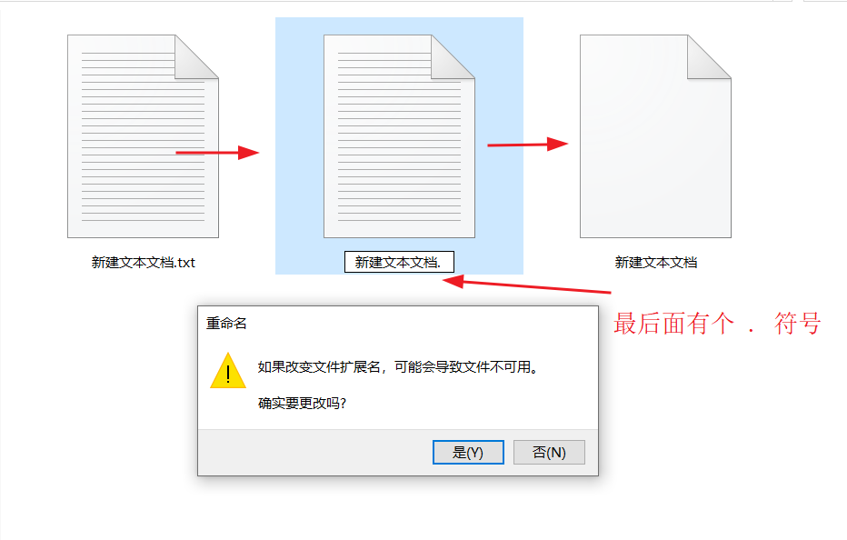
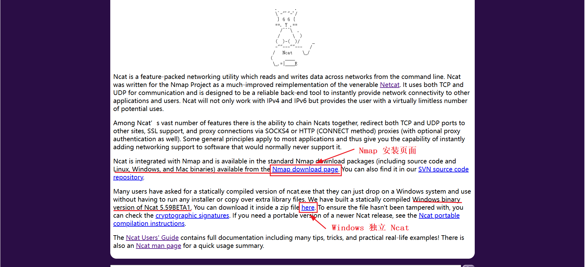
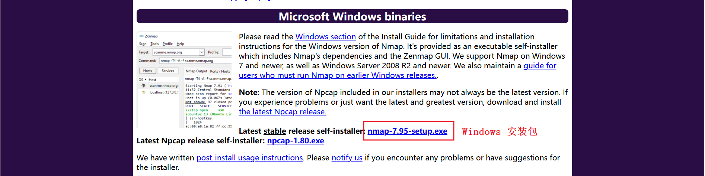
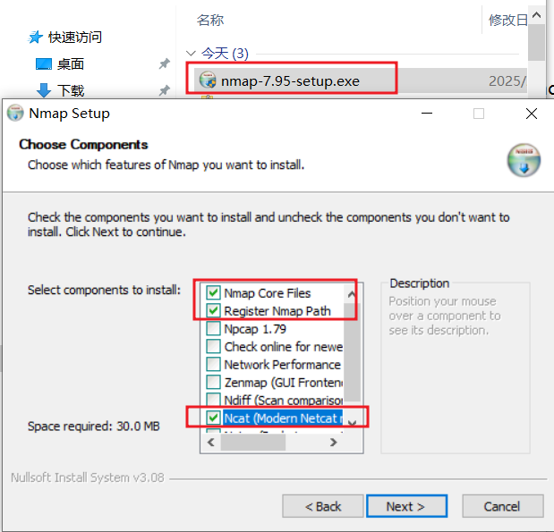
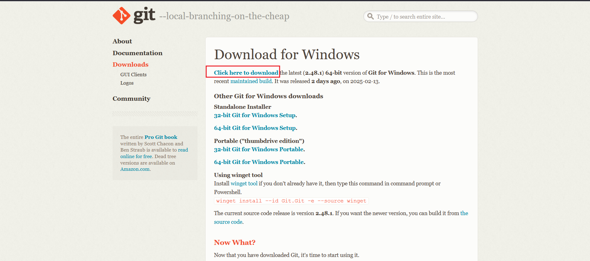
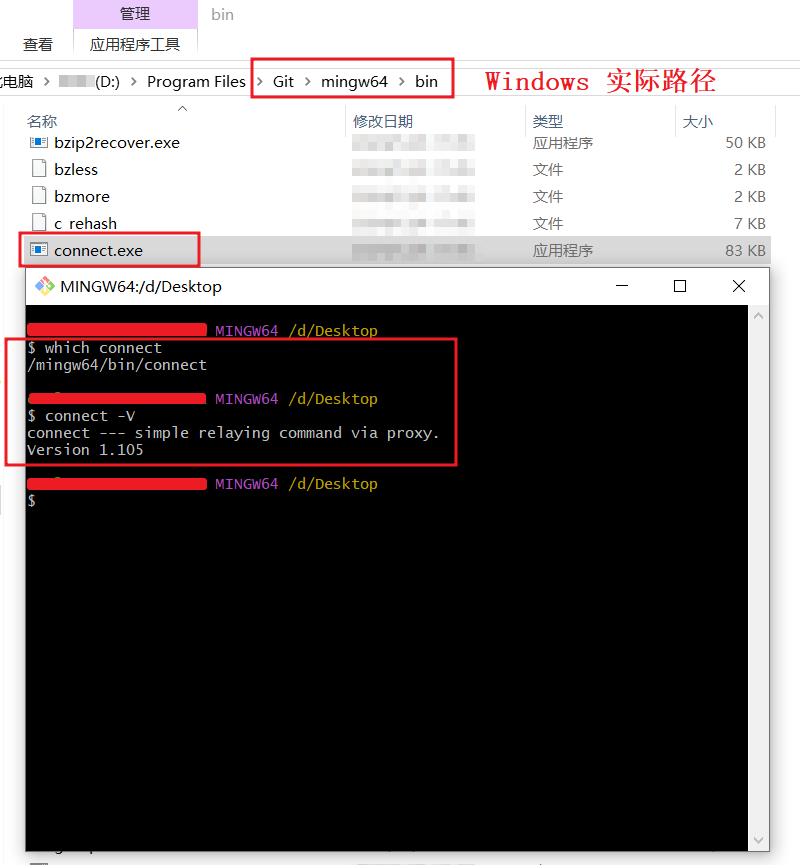
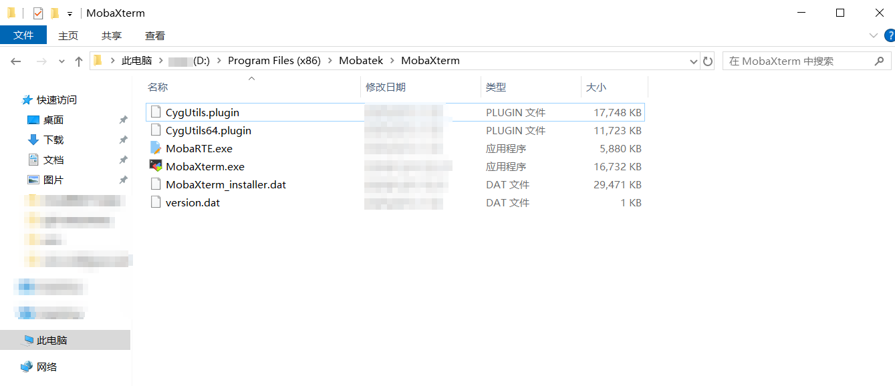
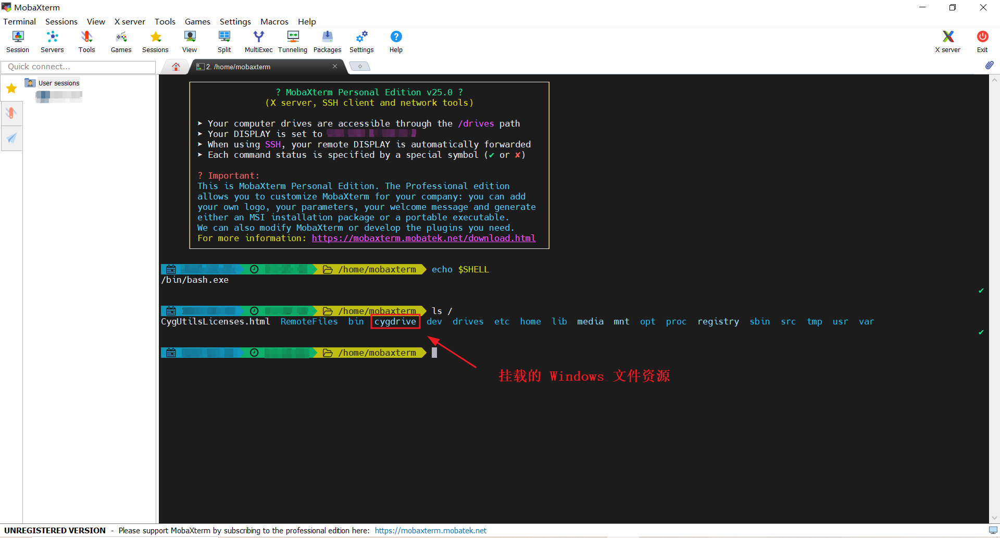
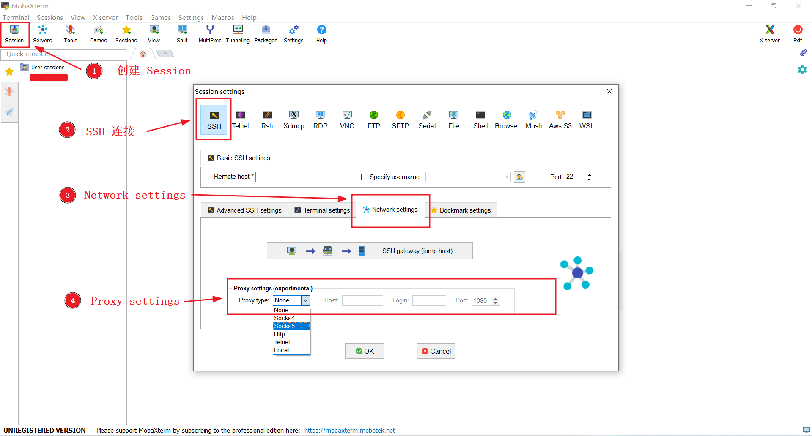
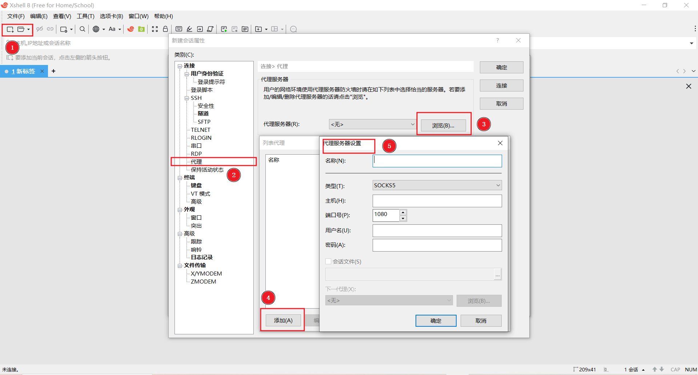

+++
title = "SSH 配置 Natcat(nc)/Nmap(ncat) 使用代理"
weight = 13
# bookFlatSection = false
# bookToc = true
# bookHidden = false
# bookCollapseSection = false
# bookComments = false
# bookSearchExclude = false
+++

## SSH 配置 Natcat(nc)/Nmap(ncat) 使用代理

> 注1：
>
> 建议使用 **配置文件** 的方式
>
> 因为如果要使用 `引号` 处理某些参数中的 `空格` 或 `转义字符` 时，参考工具对应的文档手册，使用配置文件配置会更简单更通用。
>
> 执行命令时，`"`、`'`、<code>&grave;</code> 三种引号和 `字符的转义` 等，在 Linux Shell（如 Bash）、Windows PowerShell、Windows cmd 中的解析方式完全不同，需要格外注意

> 注2：
>
> Windows 创建没有扩展名的文件时，文件名后面要添加一个 `.` 号
> 

根据 [OpenSSH 使用手册 - ProxyCommand](https://man.openbsd.org/ssh_config#ProxyCommand) 示例中提示 ssh 与 nc 结合来使用代理。

### ssh 和 nc 命令示例（需安装 Netcat 相关工具）

如下示例，ssh 配置 nc 命令，ssh 会使用 127.0.0.1:10808 的 SOCKS v5 代理连接 sshd 服务器：

{}

{}

```bash
# [OpenSSH 使用手册 - ssh_config](https://man.openbsd.org/ssh_config.5)
# SSH 配置文件路径
# ~/.ssh/config

# Host * 匹配所有主机名，用以设置全局默认值
# -X 5：SOCKS v5 代理
# -x 127.0.0.1:10808：代理地址
# 替换为自己的即可使用
Host *
    ProxyCommand nc -X 5 -x 127.0.0.1:10808 %h %p
# 其他设置
    ServerAliveInterval 15

# 匹配 github.com
Host github.com
    Hostname github.com
    ProxyCommand nc -X 5 -x 127.0.0.1:10808 %h %p
```

{}

{}

```bash
# 注：虽然是 Bash 格式，但本条命令可以在 Bash、cmd、PowerShell 执行，因为没有涉及转义字符等复杂命令解析

# [OpenSSH 使用手册 - ssh](https://man.openbsd.org/ssh)
# SSH 执行单次命令时，可用 -o（小写） 参数指定配置文件格式提供的选项，-o 可添加多次以指定多个参数

# root：sshd 登录用户名
# 192.168.0.107：sshd 主机名
# -p 27305：sshd 端口号
# -X 5：SOCKS v5 代理
# -x 127.0.0.1:10808：代理地址
# 替换为自己的即可使用

ssh -o "ProxyCommand nc -X 5 -x 127.0.0.1:10808 %h %p" -o "ServerAliveInterval 15" root@192.168.0.107 -p 27305
```
{}

{}

### ssh 和 ncat 命令示例（需安装 Nmap/Ncat 相关工具）

如下示例，若某些操作系统（Windows）安装 Nmap/Ncat 工具更方便， 可以用 ncat 命令代替 nc 命令：

{}

{}

```bash
# [OpenSSH 使用手册 - ssh_config](https://man.openbsd.org/ssh_config.5)
# SSH 配置文件路径
# ~/.ssh/config

# Host * 匹配所有主机名，用以设置全局默认值
# --proxy-type socks5：SOCKS v5 代理
# --proxy 127.0.0.1:10808：代理地址
# 替换为自己的即可使用
Host *
    ProxyCommand ncat --proxy-type socks5 --proxy 127.0.0.1:10808 %h %p
# 其他设置
    ServerAliveInterval 15

# 匹配 github.com
Host github.com
    Hostname github.com
    ProxyCommand ncat --proxy-type socks5 --proxy 127.0.0.1:10808 %h %p
```

{}

{}

```bash
# 注：虽然是 Bash 格式，但本条命令可以在 Bash、cmd、PowerShell 执行，因为没有涉及转义字符等复杂命令解析

# [OpenSSH 使用手册 - ssh](https://man.openbsd.org/ssh)
# SSH 执行单次命令时，可用 -o（小写） 参数指定配置文件格式提供的选项，-o 可添加多次以指定多个参数

# root：sshd 登录用户名
# 192.168.0.107：sshd 主机名
# -p 27305：sshd 端口号
# --proxy-type socks5：SOCKS v5 代理
# --proxy 127.0.0.1:10808：代理地址
# 替换为自己的即可使用

ssh -o "ProxyCommand ncat --proxy-type socks5 --proxy 127.0.0.1:10808 %h %p" -o "ServerAliveInterval 15" root@192.168.0.107 -p 27305
```
{}

{}

## SSH ProxyCommand 简单介绍

[SSH 技术规范 - 4. Connection Setup](https://www.rfc-editor.org/rfc/rfc4253#section-4)

>SSH works over any 8-bit clean, binary-transparent transport.  The underlying transport SHOULD protect against transmission errors, as such errors cause the SSH connection to terminate.
>
> 直译过来：SSH 可以在任何干净的 8-bit（一个字节）、透明的二进制传输连接上工作。SSH 用于工作的这个底层传输连接要**保证**传输正确，否则 SSH 断开连接。
>
> 便于理解的话就是：这个连接本身基于 8-bit（一个字节）、二进制，且不会主动发送任何内容，且支持标准输入（stdio）输出（stdout），且保证传输正确。

所以 SSH 需要的只是一个**支持读写的“裸连接”**。

所以 SSH 没有实现也没必要实现任何应用层的代理协议（如 HTTP/S，SOCKSv4/5）。

而是提供了一套通用的、基于`标准输入/输出`的连接机制，通过 `ProxyCommand` 选项 `来配置代理命令用于连接 sshd 服务器`。

执行 ssh 命令时，ssh 会先执行 ProxyCommand 配置的代理命令创建连接，然后把自己的标准输入/输出绑定到创建的连接上，以此交换数据。

- 理论上，配置的代理命令执行后，创建的连接只要满足 SSH 连接规范，这个代理命令可以是任何内容。
    - 代理命令本身是不关心是否连接到了 sshd 服务器的
    - 验证、登录、发送数据是 SSH 的事

所以配置的代理命令也可以是使用代理的，ssh 最终通过 ProxyCommand 配置间接使用代理。

如 ssh 和 nc/ncat 示意：
```shell
ssh <--------> nc/ncat <--------> SOCKS v5 <--------> sshd
```

`ProxyCommand` 配置的代理命令中可以使用 SSH 支持的 [TOKENS](https://man.openbsd.org/ssh_config#TOKENS) 传递 ssh 命令中的参数，以保证配置的代理命令正确的连接到 sshd 服务器。
- 如 `ProxyCommand="nc -X 5 -x 127.0.0.1:10808 %h %p"`，
    - 其中的 `%h` 等同于 `Hostname` 选项，表示 ssh 命令中主机名，
    - `%p` 等同于 `Port` 选项，表示 ssh 命令中的主机端口号
-  所以示例 ssh 执行命令时，代理命令实际被替换为 `nc -X 5 -x 127.0.0.1:10808  192.168.0.107 27305`
    - 虽然代理命令本身不知道连接到是什么服务
    - 但因为是 ssh 执行时替换的 ssh 参数，所以代理命令实际连接到的就是 sshd 服务
- 甚至可以直接在代理命令中写实际主机名和端口号 `ssh -o "ProxyCommand nc -X 5 -x 127.0.0.1:10808 192.168.0.107 27305" -o "ServerAliveInterval 15" root@xxx -p 123`
    - 让 nc 直接连接 192.168.0.107 27305，ssh 参数的主机名和端口号随便填或不填

## Netcat 系列工具简单介绍

Netcat 工具（nc 命令），单独使用时，只会连接到指定的地址和端口，并使用 `标准输入/输出` 对连接进行读写。

所以非常满足 SSH 传输连接的要求。

Netcat 工具因为功能简单直接，出现了较多的重写版本或功能增强版，这里列举一下常见的版本。

| 版本 | 命令 | 特点 | 操作系统安装版本推荐 | 网站 |
|:---:|:---:|:---:|:---:|:---:|
| Netcat | nc | 原版，最初由 Hobbit 作者发布。这个原版也可以叫做 nc110 |  | https://nc110.sourceforge.io/ |
| GNU Netcat | nc | GNU 实现的版本 |  | https://netcat.sourceforge.net/ |
| OpenBSD Netcat | nc | OpenBSD 系统下的实现，目前使用较广泛的版本，支持 IPv6 等其他功能，大部分 Linux 发行版包管理器都有此版本，包名通常为 `netcat-openbsd` | Linux，OpenBSD | [源码](https://github.com/openbsd/src/blob/master/usr.bin/nc/netcat.c)，[使用手册](https://man.openbsd.org/nc) |
| Ncat | ncat | NMAP 项目对 Netcat 的重新实现，支持 IPv6 等以及其他新功能，更现代化，Ncat 与 Nmap 集成 | Windows，macOS，Linux | https://nmap.org/ncat/，[使用手册](https://nmap.org/book/ncat-man.html) |
| Socat | socat | Netcat 加强版，功能较为复杂 |  | http://www.dest-unreach.org/socat/ |
| Cryptcat | cryptcat | Cryptcat 是标准的 netcat，但使用 twofish 加密了创建的连接 |  | https://cryptcat.sourceforge.io/ |
| connect | connect | 包名通常为 `connect` 或 `connect-proxy`，好像是专门给 SSH ProxyCommand 用的，功能简单。Git-for-Windows（基于 MSYS2 类 Unix 环境） 预装了这个工具 | Git-for-Windows | https://github.com/gotoh/ssh-connect |

以上是常见的 Netcat 系列的工具，可能还有一些其他的 Netcat 版本，这里就不过多介绍了。

> Netcat 系列作为网络安全、测试等领域常用的工具，所以类似或更强大的工具应该还有。
>
> 这里只是希望 ssh 能够使用代理，而 Netcat 工具功能轻便、使用简单，并且 OpenSSH 官方手册中也是使用 nc 命令作为示例，所以在此就不再寻找其他相关工具了。

## Netcat 系列工具推荐安装

### Windows

#### ① Windows Ncat （推荐）

Windows 系统下建议使用 Ncat，因为 Nmap 作为更现代化的重新实现版，官方提供了原生 Windows 系统的安装包，可直接用于 Windows 的安装和使用。而且提供了两种方式安装：

- 下载 Nmap 安装包，安装时，勾选 **Nmap 核心文件** + **注册 Nmap 路径** + **Ncat**，安装完成后 Ncat 可以直接使用（**推荐此方式**）
- 下载 Nmap 官方提供的 Ncat 独立二进制（不一定是最新版本号）压缩包，解压到某路径下，需手动配置系统环境变量（压缩包会被 Windows 安全中心识别为病毒，导致无法下载或被直接删除，且官方不会同步更新所有最新版，所以不推荐此方式）

其他版本的 Netcat 要么不方便在 Windows 安装，要么版本已不更新，要么功能较复杂，综合下来 Nmap/Ncat 在 Windows 平台非常省心方便。

如图，进入此 https://nmap.org/ncat/ 页面，两种方式均可在此页面找到描述：


推荐进入 Nmap 下载页面，找到 Nmap 安装包，下载后安装 Nmap/Ncat：


如图，Windows 安装 Nmap 界面，**勾选** `Nmap Core Files` + `Register Nmap Path` + `Ncat`


#### ② Windows Git connect

[Git 官网](https://git-scm.com/downloads/win) 下载 Git-for-Windows。

安装 Git-for-Windows 后，Git-for-Windows（基于 MSYS2 类 Unix 环境） 环境自带 connect 工具。

- 在 Git-for-Windows 环境下（如 Git Bash），可以直接使用
- 若在 Windows 环境下（如 cmd/PowerShell），需要用 connect.exe 在 Windows 的绝对路径，或手动配置 Windows 系统的环境变量，才能使用
- 如果不了解如何在 Windows 系统上使用类 Unix 环境，可能会遇到路径、执行等问题
- 即便安装 Git-for-Windows 后，也推荐安装并使用 Nmap/Ncat

如图，Windows Git 下载页面


如下图，connect.exe 在 `Windows 的实际路径` = `Git 安装路径` + `Git-for-Windows 环境下的路径`。

图中的命令行界面是 Git Bash，打印的是 connect 在 Git-for-Windows 环境下的路径。
- 安装 Git-for-Windows 时勾选安装 Git Bash。
-  安装后 Git Bash 可从 Windows 开始界面搜索打开，或从鼠标右键菜单栏打开。



### macOS

- macOS 系统下，应该预装 nc 命令了（不确定，没用过苹果）
    - `brew install nmap`（[brew - nmap](https://formulae.brew.sh/formula/nmap#default)）或者在 [Nmap 官网下载页](https://nmap.org/download.html) 下载安装 Nmap/Ncat
    - `brew install netcat`（[brew - netcat](https://formulae.brew.sh/formula/netcat#default) 此版本是 GNU Netcat）
    - brew 包管理好像没有 OpenBSD Netcat，想用高级功能可以安装 [brew - nmap](https://formulae.brew.sh/formula/nmap#default)/ncat 或 [brew - socat](https://formulae.brew.sh/formula/socat#default)

> 注：
>
> 因为没有用过苹果，所以不确定 brew 安装的 Netcat 版本具体有哪些参数可用，因为一些 Linux 包管理安装完 GNU Netcat 后还需要安装 OpenBSD Netcat 包，nc 命令才能用 -X -x 参数
>
> 用 macOS 的朋友可能要稍微注意一下

### Linux

- Linux 根据相应的发行版或包管理，选择安装

## Windows 图形化 SSH 客户端使用代理

### ① MobaXterm

[MobaXterm Download](https://mobaxterm.mobatek.net/download.html)

MobaXterm 实际上是一款增强型终端工具，但它集成了 SSH 等多种远程网络工具和 Unix 命令。
- 仅 Windows 平台
- 个人免费版，图形界面最多 12 个 sessions，个人基本够用
- 付费版

>注：
>
> 因为 MobaXterm 是基于 Cygwin 类 Unix 环境开发的，它集成的各类工具其实都是 Cygwin 的包，在 MobaXterm 内部基本可以当作 Cygwin 使用。
> - 可用包管理 apt 安装 Cygwin 分发的软件包
> - MobaXterm 服务协议不对这种安装行为负责
>
> MobaXterm 内部的 Cygwin 环境在和 Windows 环境交互上和其他一般的 Windows 类 Unix 环境也有一点区别。
>
> 在 MobaXterm 内 Cygwin 可以调用 Windows 环境的程序，因为挂载了 Windows 的文件资源。
>
> 但反过来，Windows 的其他应用程序想使用 MobaXterm 中的 Cygwin 环境工具会比较复杂，因为 MobaXterm 是作为 Windows 的应用程序开发的，其封装度较高（安装后基本只有 MobaXterm.exe 文件），Windows 环境不能直接访问其内部 Cygwin 文件资源。
>
> MobaXterm 安装后的文件目录
> 
>
> MobaXterm 界面和内部文件目录
> 

创建 SSH 连接时，可以设置使用代理：主界面工具栏 -> Session -> SSH -> Network settings -> Proxy settings
- 如果在 /home/mobaxterm 创建 SSH 配置文件配置了代理命令
    - 在其命令行界面，ssh 命令可以按正常方式使用
    - 但图形界面创建 Session 时**需再次**设置代理，否则点击图形界面 Session 连接时不会使用代理（估计因为 Session 没设置代理，点击 Session 时会把空值传递给实际执行的 ssh 命令，从而覆盖了配置文件的值）



### ② Xshell

[Xshell Download](https://www.xshell.com/zh/all-downloads/)

Xshell 作为 Windows 平台的图形化 SSH 客户端，知名度比较高。
  - 个人免费版，只有 XSHELL 和 XFTP，前者管理 SSH，后者管理 FTP
  - 付费版，XMANAGER 完整订阅包会安装所有 X 产品

> 个人感觉 MobaXterm 使用更方便，集成度也比 Xshell 高。


