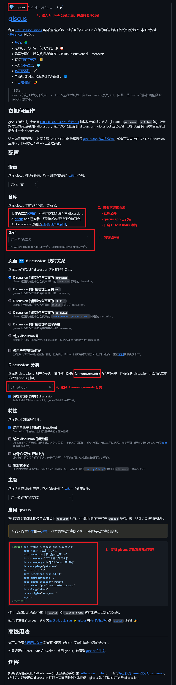
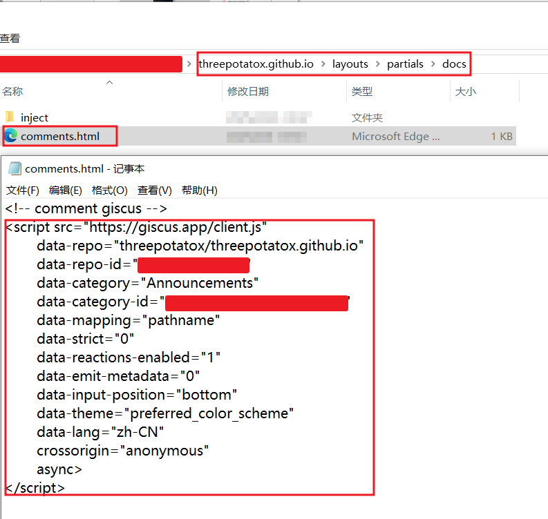

记录一下本站 Hugo Book 主题的定制或美化步骤。

## Hugo 网站自定义主题原理

Hugo 的文件查找顺序（lookup order）机制：
- Hugo在生成静态网站时，会优先使用项目根目录下的文件来覆盖主题文件

这种机制允许用户在项目根目录下创建与主题文件同名的文件，从而覆盖主题的布局、样式或其他配置。

所以能在不修改主题源代码的情况下，自定义网站的外观和行为。

```bash
project/
├── layouts/
│   └── _default/
│       └── single.html  # 覆盖主题文件
└── themes/
    └── your-theme/
        └── layouts/
            └── _default/
                └── single.html  # 被覆盖的主题文件

```

基于这个机制，再结合 Hugo 本身和具体主题预留的组件或空文件，实现主题的定制或美化。

> 有些主题功能齐全开箱即用，这样的主题，一般会预留各种自定义参数实现用户定制，而不是预留空文件让用户覆盖。
>
> 但也可以把某些主题文件复制到主目录下，在原内容基础上二次开发，但维护会比较麻烦，更新主题后要手动处理代码合并到主目录。

## Giscus 评论系统

### 获取 Giscus 评论系统配置信息

进入 [Giscus 官网获取 giscus 配置信息](https://giscus.app/zh-CN)

1. 点击 [giscus](https://github.com/apps/giscus) 进入 Github 安装页面，并选择仓库安装
2. 按要求连接仓库
    - 仓库公开
    - 仓库已安装 giscus
    - 仓库打开 Discussions 功能
3. 填写仓库名称
4. 选择新 discussions 所在的分类，推荐选 Announcements 类型
    - 因为只有管理员有权限操作 Announcements 类型的 discussion，方便管理
5. 复制 giscus 评论系统配置信息



### 评论系统添加到 Hugo Book 主题

1. 创建 `Hugo 主目录/layouts/partials/docs/comments.html`，并将整个配置信息直接粘贴到此文件
    - Hugo Book 主题默认只集成了 Discus 评论系统
    - 此方法直接覆盖了 Hugo Book 的评论模板（Book 主题作者推荐此方法）
2. 根据 Hugo Book 提供的配置参数，设置 `BookComments = true`



> 其他 Hugo 主题，可能已经集成了 Giscus 评论，只需将复制的 giscus 脚本参数按主题要求的参数格式设置参数即可。
>
> 具体设置要查看对应的主题文档，这里的方法仅针对 Hugo Book 主题。

## 代码块高亮样式

Hugo Book 的 `明/暗` 模式会自动跟随浏览器或系统。

所以自定义一份 chorma 的代码 `明/暗` 高亮样式，感觉能好看些。

生成代码高亮样式可参考 [Hugo - Generate syntax highlighter CSS](https://gohugo.io/content-management/syntax-highlighting/#generate-syntax-highlighter-css)。

1. 生成代码高亮样式，
    - 根据 Hugo Book 预留空文件，创建 `Hugo 主目录/assets/_custom.scss`，放置生成的样式代码
    - 下面生成脚本仅做示例
2. 根据 Hugo 提供的配置参数，设置 `markup.highlight.noClasses = false`
    - 表示有自定义样式

{}

{}

```bash
# 需要 hugo 命令，hugo 命令视情况可换成 绝对路径或相对路径
# 执行命令时切换到 Hugo 站点主目录
# 复制手动执行命令或者保存成脚本文件执行

mkdir -p assets
echo ""  >> assets/_custom.scss

echo "/* custom syntax highlighting style start */"  >> assets/_custom.scss
echo "/* light style*/"  >> assets/_custom.scss
echo "@media (prefers-color-scheme: light) {"  >> assets/_custom.scss
# hugo 命令视情况可换成 绝对路径或相对路径
hugo gen chromastyles --style=monokailight >> assets/_custom.scss
echo "}" >> assets/_custom.scss

echo "/* dark style*/"  >> assets/_custom.scss
echo "@media (prefers-color-scheme: dark) {"  >> assets/_custom.scss
# hugo 命令视情况可换成 绝对路径或相对路径
hugo gen chromastyles --style=monokai >> assets/_custom.scss
echo "}" >> assets/_custom.scss
echo "/* custom syntax highlighting style end */"  >> assets/_custom.scss
```

{}

{}

## 图片灯箱功能

Hugo Book 图片没有灯箱功能，图片不能点击弹窗放大，有些会看不清楚。

所以使用了一个基于 JavaScript 的 Fancybox 灯箱库，给图片加上灯箱效果，图片可以点击弹出、放大、下载等。

部分教程是通过引入 Fancybox 后，再实现 Hugo 的 `shortcode`，再用 `shortcode` 在文章中表示图片。

新文章这样可以，但已有文章的 Markdown 语法图片就要手动去修改了。

希望直接用标准 Markdown 语法表示图片就好，同时也不需要 `shortcode` 形式提供额外的自定义图片参数。

所以参考 [Hugo Fancybox实现图片灯箱效果 -- by UsefulBlog](https://blog.tcp.im/post/jianzhan/hugo-fancybox/) 方案。基于 [Hugo Markdown Render Hooks](https://gohugo.io/getting-started/configuration-markup/#markdown-render-hooks) 机制来添加图片灯箱功能。

1. Hugo Book 引入 Fancybox 库，并配置 Fancybox 默认参数
- 根据 Hugo Book 预留空文件，创建 `Hugo 主目录/layouts/partials/docs/inject/footer.html`，保存下面 HTML 代码。
    - [Fancybox 灯箱可用的 Toolbar 按钮](https://fancyapps.com/fancybox/plugins/toolbar/#examples)
    - [Fancybox - Panzoom Options 配置选项](https://fancyapps.com/panzoom/api/options/)

> 注：这里把参考方案中的判断参数去掉了，所以会在所有页面都引入 Fancybox 库并开启图片灯箱效果

```html
<!-- path: Hugo 主目录/layouts/partials/docs/inject/footer.html -->

<!-- custom start -->

<!-- 
  Image lightbox functionality: enabled by integrating "Fancybox" via "Markdown Render Hooks"
  图片灯箱效果：通过 Markdown Render Hooks 集成 Fancybox
-->
<script src="https://cdnjs.cloudflare.com/ajax/libs/fancyapps-ui/5.0.36/fancybox/fancybox.umd.min.js" integrity="sha512-VNk0UJk87TUyZyWXUFuTk6rUADFyTsVpVGaaFQQIgbEXAMAdGpYaFWmguyQzEQ2cAjCEJxR2C++nSm0r2kOsyA==" crossorigin="anonymous" referrerpolicy="no-referrer"></script>
<link rel="stylesheet" href="https://cdnjs.cloudflare.com/ajax/libs/fancyapps-ui/5.0.36/fancybox/fancybox.min.css" integrity="sha512-s4DOVHc73MjMnsueMjvJSnYucSU3E7WF0UVGRQFd/QDzeAx0D0BNuAX9fbZSLkrYW7V2Ly0/BKHSER04bCJgtQ==" crossorigin="anonymous" referrerpolicy="no-referrer" />

<script>
  Fancybox.bind("[data-fancybox]", {
  // Your custom options
  Images: {
    Panzoom: {
      maxScale: 5,
    },
  },
  Toolbar: {
    display: {
      left: ["infobar"],
      middle: [
      "zoomIn",
      "zoomOut",
      "toggle1to1",
      "rotateCCW",
      "rotateCW",
      "flipX",
      "flipY",
      ],
      right: ["slideshow", "thumbs", "download", "close"],
    },
  },
});
</script>

<!-- custom end -->
```
2. 添加 Hugo render-hooks images 模板文件
- 根据 [Hugo Markdown Render Hooks](https://gohugo.io/getting-started/configuration-markup/#markdown-render-hooks) 创建 `Hugo 主目录/layouts/_default/_markup/render-image.html`，保存下面 Hugo 模板 HTML 代码。
    - [Hugo - render-hooks - images - example](https://gohugo.io/render-hooks/images/#examples)
    - [Fancybox - Getting Started](https://fancyapps.com/fancybox/getting-started/)

```html
<!-- path: Hugo 主目录/layouts/_default/_markup/render-image.html -->

<!-- custom start -->

<!-- 
  Image lightbox functionality: enabled by integrating "Fancybox" via "Markdown Render Hooks"
  图片灯箱效果：通过 Markdown Render Hooks 集成 Fancybox
-->
<div class="post-img-view">

  <a data-fancybox="gallery" href="{{ .Destination | safeURL }}" data-caption="{{ .Text }}" >
      
  </a>
  
</div>

<!-- custom end -->
```
